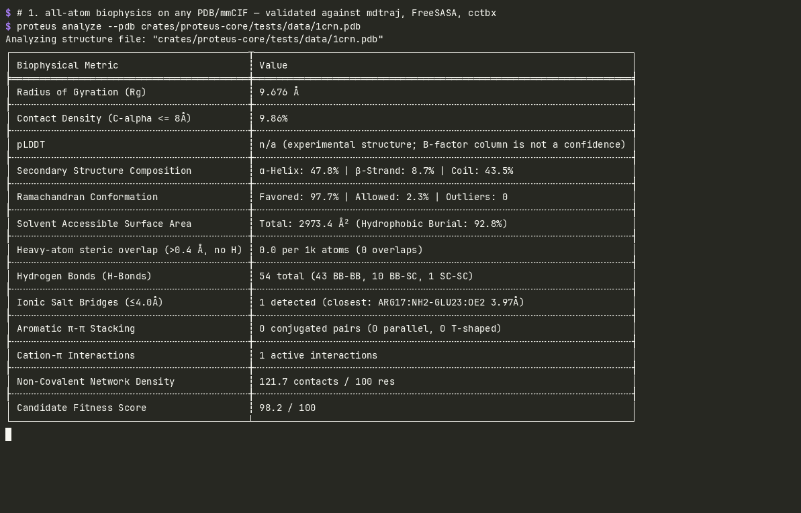

# proteus

[](https://github.com/OtoYuki/proteus/actions/workflows/ci.yml)
[](https://github.com/OtoYuki/proteus/actions/workflows/validate.yml)
[](https://github.com/OtoYuki/proteus/actions/workflows/tes-conformance.yml)
[](https://github.com/OtoYuki/proteus/releases)
[](Cargo.toml)
[](#license)

The protein-engineering design loop as one binary, with a GA4GH TES server in it.



```bash
proteus mutate wt.fasta --mode saturation \
  | proteus screen - --tier sota --export library.parquet     # mutate → fold → validate → rank
proteus view <job> --interactive --dashboard                   # and look at it, over SSH
```

Every stage of that loop already has a good tool — Boltz folds, mdtraj and FreeSASA measure,
PyMOL draws. What is usually missing is the **seam**: the glue that carries a scaffold through
mutagenesis, structure prediction, all-atom validation, ranking and a columnar dataset without a
pile of one-off Python that nobody keeps. Proteus is that seam, and it speaks
**GA4GH TES 1.1**, so Nextflow and Sprocket can drive it as a compute backend instead of you
writing a new pipeline.

Two consequences worth stating up front:

- **It refuses to rank a structure it could not really predict.** Offline placeholders are
  excluded from the leaderboard unless you ask for them, and a tier that silently fell back
  tells you which tier you asked for and why it could not honour it.
- **Every scientific number is checked against someone else's implementation, in CI** — mdtraj,
  FreeSASA, cctbx/MolProbity and PLIP over 53 structures. Where no reference exists, the row
  below says so rather than letting you assume.

| what | how it is checked |
|---|---|
| φ/ψ, Cα radius of gyration, Kabsch RMSD | mdtraj, every angle within 0.1° |
| Kabsch–Sander DSSP (`proteus-dssp`, standalone crate) | mdtraj, ≥ 98 % per-residue |
| MolProbity Ramachandran (Top8000 contours from cctbx) | cctbx `ramalyze`, 100 % label agreement |
| Shrake–Rupley SASA (Bondi radii, 960 pts) | mdtraj ≤ 1 %, FreeSASA ≤ 4 % (L&R, ProtOr radii) |
| hydrogen-bond network | mdtraj `baker_hubbard` (explicit-H reference, six NMR entries): 86–100 % recall, 58–76 % precision — heavy-atom criteria over-detect by 1.3–1.7× |
| salt bridges, π–π stacking, cation–π | PLIP (intra-chain, 15 structures): salt-bridge precision **97.7 %** / recall 72 %; π–π **81.8 / 81.8 %**; cation–π **73.9 / 65.4 %**. Cutoffs differ by design — ours is the stricter salt-bridge rule |
| heavy-atom steric overlap | Proteus-defined; labelled as such |

**What this is not.** Not a folding engine — it orchestrates ESMFold and Boltz rather than
predicting structure itself. Not a replacement for Mol\*, PyMOL or ChimeraX for interactive
analysis. The composite fitness score is a triage filter, not a predictor of experimental
stability or activity; `--scorer esm2` is the sequence-level answer. And the terminal viewer is
no longer unusual — [ProteinView](https://github.com/001TMF/ProteinView),
[StrucTTY](https://github.com/steineggerlab/StrucTTY) and
[pixelfold](https://github.com/fuyu-myk/pixelfold) all render structures in a terminal. What is
still unoccupied is the loop and the TES server.

**Speed** (same metric, same file, median wall-clock; full table in [`bench/README.md`](bench/README.md)):
SASA 2.3–4.7× faster than mdtraj's C++ kernel at equal point count and ~33× faster than
Biopython; DSSP 1.3–12× vs mdtraj; φ/ψ + Ramachandran 33–159× vs mdtraj's φ/ψ API. 6VXX
(22 812 atoms) full profile: 0.69 s.

## Install

```bash
# release binaries (Linux x86_64/aarch64, macOS x86_64/arm64)
curl -L https://github.com/OtoYuki/proteus/releases/latest/download/proteus-x86_64-unknown-linux-gnu.tar.gz | tar xz
# from source (Rust 1.94+); the binary is not on crates.io — that name is an unrelated project
cargo install --git https://github.com/OtoYuki/proteus proteus-cli
# container: the CLI works as is; `serve` needs the host's container socket for TES executors
podman run --rm -v "$PWD:/w" ghcr.io/otoyuki/proteus analyze --pdb /w/structure.pdb
podman run --rm -p 8080:8080 -v /run/user/$(id -u)/podman/podman.sock:/var/run/docker.sock \
  -v proteus-data:/data ghcr.io/otoyuki/proteus serve --host 0.0.0.0 --allow-dir /data
```

---

## Architecture

The project is a Cargo workspace of eight crates. `proteus-dssp` and `proteus-esm` depend on
nothing else here and are usable on their own; the other six are the application and ship as
the `proteus` binary:

```
crates/
├── proteus-core/       Domain models, FASTA parser, DMS mutagenesis, and native biophysics
├── proteus-dssp/       Standalone pure-Rust Kabsch–Sander DSSP secondary-structure assignment
├── proteus-esm/        Standalone ESM-2 masked-LM inference on candle (mutation scoring, DMS scans)
├── proteus-storage/    Embedded SQLite repository (SQLx WAL), BLAKE3 CAS, Parquet/CSV/JSON export
├── proteus-engine/     Async job scheduler, prediction runners, TES task execution (bollard)
├── proteus-render/     Software 3D rasterizer, Bishop ribbon extruder, and TUI dashboard
├── proteus-server/     Headless Axum daemon (proteusd): GA4GH TES 1.1, native API, SSE, OpenAPI
└── proteus-cli/        The `proteus` binary: mutate, screen, analyze, view, esm, submit, serve
```

`proteus-dssp` and `proteus-esm` are the two crates meant for use outside Proteus. The
application crates are not published to crates.io — `proteus-engine` and `proteus-cli` are
taken there by unrelated projects — so the binary installs from the releases, the ghcr image,
or `cargo install --git`.

---

## Core Capabilities

### 1. In-Silico Deep Mutational Scanning (DMS)
Generates high-density mutant variant libraries directly from wildtype scaffolds:
- **Alanine Scanning:** Systematic single-point mutations to Alanine across selected sequence windows to map critical functional epitopes.
- **Site-Saturation Mutagenesis:** Exhaustive substitution of all 20 canonical amino acids across target active sites or binding interfaces.
- **Pipeline Streaming:** Native UNIX pipeline support (`mutate | screen -`) for zero-disk intermediate streaming.

### 2. High-Throughput Screening Funnel & Parquet Data Lake
Evaluates variant libraries across multi-threaded computational workers:
- **Multi-Tier Inference:** Dispatches structural prediction jobs to a local OCI container image when present, else the Meta ESMFold API. When neither is reachable the offline simulator produces a placeholder helix; those structures are flagged `engine = simulated`, excluded from the ranking unless `--runner simulated` is given, and never presented as predictions. **No prediction image is published:** to use the container tier, build or pull an ESMFold/Boltz image yourself and point `PROTEUS_IMAGE_FAST` / `PROTEUS_IMAGE_SOTA` at it (the Boltz tier writes Boltz-format FASTA; the relax tier is not implemented).
- **Weighted Composite Fitness Score:** Ranks candidates by a weighted sum of pLDDT confidence (predicted models only), compactness ($R_g$ vs the empirical folded-protein law $2.2\,N^{0.38}$ Å), MolProbity Ramachandran quality, hydrophobic core burial and non-covalent network density, minus a steric-overlap penalty. For experimental structures the pLDDT weight is redistributed over the other terms. **This is a triage filter, not a fitness predictor:** it is checked only on whether a folded structure outranks a broken one (40/40 native-vs-decoy pairs, `make validate`), and it is not validated against experimental stability or activity. For sequence-level fitness use `--scorer esm2`.
- **Columnar Data Lake Export:** Serializes screened variant batches into ZSTD-compressed Apache Parquet files using canonical Apache Arrow schemas for direct query execution in DuckDB, Polars, or PyArrow.

### 3. Pure-Rust Terminal 3D Rasterizer & Live Telemetry Dashboard
Enables full structural inspection over SSH without X11 forwarding, WebGL browser dependencies, or headless display servers:
- **Cartoon Ribbon Mesh Generation:** Cubic Hermite splines through the $C_\alpha$ trace, with the ribbon's wide face oriented by the backbone carbonyl and flip-corrected (Carson & Bugg 1986) so $\beta$-strands lie flat in their sheet and show its real twist — checked against the H-bond network, not just drawn (partner strands agree to 21–31°, the sheet's genuine twist; an arbitrary frame gives 25–84°). Parallel-transport frames are the fallback for $C_\alpha$-only traces. Elliptic cross-sections and Richardson $\beta$-arrowheads.
- **It tells you when the picture cannot show what you asked for:** at 3.4 Å per pixel, consecutive residues (3.8 Å apart) cannot be separated, so `view` says so and points at a finer backend rather than letting an outline be read as detail.
- **Lighting & Post-Processing:** Software $z$-buffer rasterizer with directional Blinn-Phong shading, Screen-Space Ambient Occlusion (SSAO), and edge-detection cel-outlines.
- **Covalent Disulfide Bridges:** Automatically detects and renders cystine covalent bonds ($S_\gamma - S_\gamma$) as high-visibility sidechain cylinders.
- **Multi-Structure Superposition:** Visualizes pairwise structural alignments in distinct dual-color palettes with Kabsch RMSD metrics.
- **Terminal Compositing:** ANSI 24-bit half-block (1×2 px/cell), sub-pixel Braille (2×4 dots/cell), **DEC Sixel** (xterm, mlterm, foot, contour, WezTerm, Windows Terminal) and the kitty graphics protocol. Sixel is 6–21× cheaper on the wire than kitty at the same resolution, which is what you want over SSH, and its encoder is round-tripped through libsixel's own decoder in CI rather than eyeballed.
- **Live TUI Dashboard:** Split-screen layout displaying real-time 3D rotation alongside an ASCII Ramachandran ($\phi, \psi$) conformational scatter plot, per-residue pLDDT spectrum, and biophysical metrics.

### 4. Native Biophysical Validation Engines
All-atom biophysics in pure Rust (a full crambin profile takes ~8 ms, 6VXX with 22 812 atoms ~0.6 s; see `bench/`):
- **Non-Covalent Interaction Networks (NCIN):** Evaluates all-atom hydrogen bonds (Baker-Hubbard heavy-atom antecedent criteria across backbone and sidechains), ionic salt bridges ($\le 4.0\text{ \AA}$ between basic cations and acidic anions), $\pi$-$\pi$ aromatic stacking (parallel displaced and T-shaped edge-to-face), and cation-$\pi$ interactions over $O(N)$ spatial bounding-box cell lists.
- **Shrake-Rupley SASA:** Solvent-accessible surface area and hydrophobic core burial from a 960-point Fibonacci sphere per atom (mdtraj's default, Bondi radii) over an $O(N)$ spatial cell list.
- **MolProbity Ramachandran Evaluation:** Backbone $\phi/\psi$ are scored against the six Top8000 percentile contour grids (general, Gly, cis-Pro, trans-Pro, pre-Pro, Ile/Val) converted from cctbx, with MolProbity's Favored ≥ 2 % / Allowed ≥ 0.05–0.2 % thresholds. Labels agree with cctbx `ramalyze` on 100 % of residues across the validation corpus.
- **Kabsch–Sander DSSP (`proteus-dssp`):** Eight-state secondary structure from backbone H-bond energies (α/3₁₀/π helices, bridges, ladders, bends, turns), a standalone pure-Rust crate validated residue-by-residue against mdtraj.
- **Heavy-Atom Steric Overlap (MolProbity-style, no hydrogens):** Counts severe heavy-atom overlaps ($> 0.40\text{ \AA}$) per 1,000 atoms using Bondi van der Waals radii, cell-list spatial hashing, and covalent exclusions (intra-residue bonding, peptide backbone linkages, proline pyrrolidine ring geometry, and disulfide bridges). This is **not** the MolProbity clashscore, which adds hydrogens with Reduce first; it under-counts on deposited structures and is intended as a relative screen for grossly overlapping predicted models.
- **Kabsch Coordinate Superposition:** Computes optimal rotational alignment and minimum RMSD via Singular Value Decomposition (SVD) on $3 \times 3$ covariance matrices (`nalgebra`).

### 5. ESM-2 Protein Language Model, in Pure Rust
`proteus-esm` re-implements `EsmForMaskedLM` on [candle](https://github.com/huggingface/candle) —
no Python, no PyTorch, one static binary. It loads any `facebook/esm2_*` checkpoint and produces
zero-shot mutation scores (wild-type or masked marginals, Meier et al. 2021) and full deep
mutational scans.

```bash
proteus esm score wildtype.fasta --mutations P19A,C4S --esm-masked
proteus esm scan wildtype.fasta --export scan.csv            # 20×L matrix + terminal heat map
proteus mutate wt.fasta --mode saturation | proteus screen - --scorer hybrid --export lib.parquet
```

- **Parity:** logits within 1e-2 and amino-acid log-probabilities within 5e-3 of
  `transformers.EsmForMaskedLM` (fp32) on three proteins × two checkpoints, pinned in CI-runnable
  tests against committed reference values.
- **Accuracy on real data:** ProteinGym v1.1 Spearman ρ, five smallest single-mutant assays —
  mean |ρ| 0.42 with `esm2_t12_35M`, 0.24 with `esm2_t6_8M` ([`bench/README.md`](bench/README.md)).
- `--scorer esm2` ranks a screening library by sequence likelihood; `--scorer hybrid` combines it
  with the structural fitness score. Both add an `esm2_score` column to the Parquet export.
- **Where it is known to be unreliable**, from the published benchmarks rather than our own:
  zero-shot ESM-2 is a reasonable triage signal for human and microbial proteins, and a poor one
  for **viral proteins** and **long multi-domain sequences**. `proteus esm` says so when it runs
  past 400 residues. ESM-2 is used here rather than ESM-3 because ESM-3's weights are
  non-commercial; ESM C 300M is MIT-licensed and is the natural next checkpoint to support.

### 6. Validated Against Reference Implementations
Every push runs `make validate` (`.github/workflows/validate.yml`) over a **53**-structure corpus (X-ray, NMR, cryo-EM, AlphaFold-DB; PDB and mmCIF) and compares each metric to an independent implementation: **mdtraj** (φ/ψ, DSSP, $R_g$, Shrake–Rupley SASA), **FreeSASA** (Lee–Richards SASA) and **cctbx/MolProbity `ramalyze`** (Top8000 Ramachandran). Tolerances are the contract in `validate/tolerances.toml`; the full table for the last run is written to `validate/last_run.md`. Excerpt:

| id | fmt | kind | res | Δrg Å | SASA vs mdtraj | SASA vs freesasa | φ/ψ ≤tol | DSSP-8 | DSSP-3 | Rama labels | F/A/O proteus | F/A/O cctbx |
|---|---|---|---|---|---|---|---|---|---|---|---|---|
| 1crn | pdb | xray | 46 | 0.000 | 0.15% | 0.86% | 90/90 | 100.0% | 100.0% | 100.00% | 43/1/0 | 43/1/0 |
| 1tim | pdb | xray | 494 | 0.000 | 0.06% | 3.42% | 984/984 | 100.0% | 100.0% | 100.00% | 306/123/61 | 306/123/61 |
| 1ubq | pdb | xray | 76 | 0.000 | 0.05% | 1.40% | 150/150 | 100.0% | 100.0% | 100.00% | 74/0/0 | 74/0/0 |
| 2kod | pdb | nmr | 176 | 0.000 | 0.00% | 1.06% | 348/348 | 100.0% | 100.0% | 100.00% | 155/8/9 | 155/8/9 |
| 4hhb | pdb | xray | 574 | 0.000 | 0.07% | 2.03% | 1140/1140 | 100.0% | 100.0% | 100.00% | 505/54/7 | 505/54/7 |
| 6vxx | cif | cryoem | 2916 | 0.000 | 0.02% | – | 5760/5760 | 97.8% | 100.0% | 100.00% | 2775/69/0 | 2775/69/0 |
| af-p38398 | cif | afdb | 1863 | 0.000 | 0.01% | – | 3724/3724 | 100.0% | 100.0% | 100.00% | 826/413/622 | 826/413/622 |
| af-p69905 | cif | afdb | 142 | 0.000 | 0.05% | – | 282/282 | 100.0% | 100.0% | 100.00% | 138/2/0 | 138/2/0 |

Δrg is the absolute Cα radius-of-gyration error in Å; SASA columns are relative errors; φ/ψ counts angles within 0.1°; F/A/O are MolProbity Favored/Allowed/Outlier counts. See `validate/README.md` for what is and is not covered.

---

## Quickstart

### Prerequisites
- **Rust Toolchain:** 1.94+ (MSRV, checked in CI)
- **Container Runtime (Optional):** Podman rootless socket (`systemctl --user enable --now podman.socket`) or Docker daemon for live OCI container execution.

### Build
```bash
cargo build --release
```
The compiled binary will be located at `target/release/proteus`.

### Verification & Test Suite
```bash
# Workspace unit, integration and doc tests
cargo test --workspace

# End-to-end smoke test of the release binary (add `--tes IMAGE` to run a TES task in a container)
cargo build --release && scripts/smoke.sh

# Strict lint check
cargo clippy --workspace --all-targets -- -D warnings

# Code formatting check
cargo fmt --check

# Reference validation (downloads a ~50 MB corpus once; needs uv)
make validate

# Benchmarks (criterion + mdtraj/FreeSASA/Biopython baselines)
bench/run.sh
```

---

## CLI Reference

### 1. In-Silico Mutagenesis (`proteus mutate`)
Generate an Alanine scanning variant library:
```bash
proteus mutate scaffold.fasta --mode alanine --output alanine_library.fasta
```

Generate a site-saturation library restricted to residues 10–18:
```bash
proteus mutate scaffold.fasta --mode saturation --start 10 --end 18 --max-variants 50
```

### 2. High-Throughput Screening (`proteus screen`)
Screen a variant library through the compute funnel and export candidate biophysics to Apache Parquet:
```bash
proteus screen alanine_library.fasta \
  --tier fast \
  --workers 8 \
  --min-plddt 75.0 \
  --top 10 \
  --export results.parquet
```

Pipe mutations directly into the screening funnel without saving intermediate FASTA files:
```bash
proteus mutate wildtype.fasta --mode alanine | proteus screen - --export results.parquet
```
Every export row carries an `engine` column (`esmfold-api`, `oci`, `simulated`); the Parquet
file is tagged `proteus.schema_version = 4`.

### 3. Terminal 3D Structure Viewer (`proteus view`)
Launch the interactive 3D viewer with the live split-screen biophysical dashboard:
```bash
proteus view structure.pdb --interactive --dashboard
```

Interactive keyboard controls:
- `Arrow Keys` / `hjkl`: orbit (yaw / pitch).
- `+` / `-`: zoom.
- `Space`: toggle auto-rotation.
- `Tab` / `b`: toggle the telemetry dashboard (needs `--dashboard`).
- `c`: cycle colour scheme (pLDDT → secondary structure → rainbow).
- `o`: toggle SSAO and outlines; `d`: toggle disulfide sticks.
- `r`: reset the camera to the principal-axis view it opened with.
- `q` / `Esc` / `Ctrl-C`: quit.

Superimpose two structures to visually inspect conformational changes:
```bash
proteus view mutant.pdb --compare wildtype.pdb --interactive
```

Render high-fidelity terminal snapshots to stdout for scripting and CI logs:
```bash
# High-resolution Braille rendering
proteus view structure.pdb --backend braille --width 80 --height 36

# Full-color ANSI half-block rendering
proteus view structure.pdb --backend halfblock --color ss --width 80 --height 36

# Native Kitty graphics protocol (kitty, wezterm, ghostty)
proteus view structure.pdb --backend kitty --width 100 --height 40
```

### 4. Offline Biophysical Analysis (`proteus analyze`)
Inspect all-atom biophysical metrics for any local PDB structure:
```bash
proteus analyze --pdb structure.pdb
```
Output (1CRN, crambin — an X-ray structure, so no pLDDT is reported):
```
┌──────────────────────────────────────────┬───────────────────────────────────────────────────────────────────┐
│ Biophysical Metric                       ┆ Value                                                             │
╞══════════════════════════════════════════╪═══════════════════════════════════════════════════════════════════╡
│ Radius of Gyration (Rg)                  ┆ 9.676 Å                                                           │
├╌╌╌╌╌╌╌╌╌╌╌╌╌╌╌╌╌╌╌╌╌╌╌╌╌╌╌╌╌╌╌╌╌╌╌╌╌╌╌╌╌╌┼╌╌╌╌╌╌╌╌╌╌╌╌╌╌╌╌╌╌╌╌╌╌╌╌╌╌╌╌╌╌╌╌╌╌╌╌╌╌╌╌╌╌╌╌╌╌╌╌╌╌╌╌╌╌╌╌╌╌╌╌╌╌╌╌╌╌╌┤
│ Contact Density (C-alpha <= 8Å)          ┆ 9.86%                                                             │
├╌╌╌╌╌╌╌╌╌╌╌╌╌╌╌╌╌╌╌╌╌╌╌╌╌╌╌╌╌╌╌╌╌╌╌╌╌╌╌╌╌╌┼╌╌╌╌╌╌╌╌╌╌╌╌╌╌╌╌╌╌╌╌╌╌╌╌╌╌╌╌╌╌╌╌╌╌╌╌╌╌╌╌╌╌╌╌╌╌╌╌╌╌╌╌╌╌╌╌╌╌╌╌╌╌╌╌╌╌╌┤
│ pLDDT                                    ┆ n/a (experimental structure; B-factor column is not a confidence) │
├╌╌╌╌╌╌╌╌╌╌╌╌╌╌╌╌╌╌╌╌╌╌╌╌╌╌╌╌╌╌╌╌╌╌╌╌╌╌╌╌╌╌┼╌╌╌╌╌╌╌╌╌╌╌╌╌╌╌╌╌╌╌╌╌╌╌╌╌╌╌╌╌╌╌╌╌╌╌╌╌╌╌╌╌╌╌╌╌╌╌╌╌╌╌╌╌╌╌╌╌╌╌╌╌╌╌╌╌╌╌┤
│ Secondary Structure Composition          ┆ α-Helix: 47.8% | β-Strand: 8.7% | Coil: 43.5%                     │
├╌╌╌╌╌╌╌╌╌╌╌╌╌╌╌╌╌╌╌╌╌╌╌╌╌╌╌╌╌╌╌╌╌╌╌╌╌╌╌╌╌╌┼╌╌╌╌╌╌╌╌╌╌╌╌╌╌╌╌╌╌╌╌╌╌╌╌╌╌╌╌╌╌╌╌╌╌╌╌╌╌╌╌╌╌╌╌╌╌╌╌╌╌╌╌╌╌╌╌╌╌╌╌╌╌╌╌╌╌╌┤
│ Ramachandran Conformation                ┆ Favored: 97.7% | Allowed: 2.3% | Outliers: 0                      │
├╌╌╌╌╌╌╌╌╌╌╌╌╌╌╌╌╌╌╌╌╌╌╌╌╌╌╌╌╌╌╌╌╌╌╌╌╌╌╌╌╌╌┼╌╌╌╌╌╌╌╌╌╌╌╌╌╌╌╌╌╌╌╌╌╌╌╌╌╌╌╌╌╌╌╌╌╌╌╌╌╌╌╌╌╌╌╌╌╌╌╌╌╌╌╌╌╌╌╌╌╌╌╌╌╌╌╌╌╌╌┤
│ Solvent Accessible Surface Area          ┆ Total: 2973.4 Ų (Hydrophobic Burial: 92.8%)                      │
├╌╌╌╌╌╌╌╌╌╌╌╌╌╌╌╌╌╌╌╌╌╌╌╌╌╌╌╌╌╌╌╌╌╌╌╌╌╌╌╌╌╌┼╌╌╌╌╌╌╌╌╌╌╌╌╌╌╌╌╌╌╌╌╌╌╌╌╌╌╌╌╌╌╌╌╌╌╌╌╌╌╌╌╌╌╌╌╌╌╌╌╌╌╌╌╌╌╌╌╌╌╌╌╌╌╌╌╌╌╌┤
│ Heavy-atom steric overlap (>0.4 Å, no H) ┆ 0.0 per 1k atoms (0 overlaps)                                     │
├╌╌╌╌╌╌╌╌╌╌╌╌╌╌╌╌╌╌╌╌╌╌╌╌╌╌╌╌╌╌╌╌╌╌╌╌╌╌╌╌╌╌┼╌╌╌╌╌╌╌╌╌╌╌╌╌╌╌╌╌╌╌╌╌╌╌╌╌╌╌╌╌╌╌╌╌╌╌╌╌╌╌╌╌╌╌╌╌╌╌╌╌╌╌╌╌╌╌╌╌╌╌╌╌╌╌╌╌╌╌┤
│ Hydrogen Bonds (H-Bonds)                 ┆ 54 total (43 BB-BB, 10 BB-SC, 1 SC-SC)                            │
├╌╌╌╌╌╌╌╌╌╌╌╌╌╌╌╌╌╌╌╌╌╌╌╌╌╌╌╌╌╌╌╌╌╌╌╌╌╌╌╌╌╌┼╌╌╌╌╌╌╌╌╌╌╌╌╌╌╌╌╌╌╌╌╌╌╌╌╌╌╌╌╌╌╌╌╌╌╌╌╌╌╌╌╌╌╌╌╌╌╌╌╌╌╌╌╌╌╌╌╌╌╌╌╌╌╌╌╌╌╌┤
│ Ionic Salt Bridges (≤4.0Å)               ┆ 1 detected (closest: ARG17:NH2-GLU23:OE2 3.97Å)                   │
├╌╌╌╌╌╌╌╌╌╌╌╌╌╌╌╌╌╌╌╌╌╌╌╌╌╌╌╌╌╌╌╌╌╌╌╌╌╌╌╌╌╌┼╌╌╌╌╌╌╌╌╌╌╌╌╌╌╌╌╌╌╌╌╌╌╌╌╌╌╌╌╌╌╌╌╌╌╌╌╌╌╌╌╌╌╌╌╌╌╌╌╌╌╌╌╌╌╌╌╌╌╌╌╌╌╌╌╌╌╌┤
│ Aromatic π-π Stacking                    ┆ 0 conjugated pairs (0 parallel, 0 T-shaped)                       │
├╌╌╌╌╌╌╌╌╌╌╌╌╌╌╌╌╌╌╌╌╌╌╌╌╌╌╌╌╌╌╌╌╌╌╌╌╌╌╌╌╌╌┼╌╌╌╌╌╌╌╌╌╌╌╌╌╌╌╌╌╌╌╌╌╌╌╌╌╌╌╌╌╌╌╌╌╌╌╌╌╌╌╌╌╌╌╌╌╌╌╌╌╌╌╌╌╌╌╌╌╌╌╌╌╌╌╌╌╌╌┤
│ Cation-π Interactions                    ┆ 0 active interactions                                             │
├╌╌╌╌╌╌╌╌╌╌╌╌╌╌╌╌╌╌╌╌╌╌╌╌╌╌╌╌╌╌╌╌╌╌╌╌╌╌╌╌╌╌┼╌╌╌╌╌╌╌╌╌╌╌╌╌╌╌╌╌╌╌╌╌╌╌╌╌╌╌╌╌╌╌╌╌╌╌╌╌╌╌╌╌╌╌╌╌╌╌╌╌╌╌╌╌╌╌╌╌╌╌╌╌╌╌╌╌╌╌┤
│ Non-Covalent Network Density             ┆ 119.6 contacts / 100 res                                          │
├╌╌╌╌╌╌╌╌╌╌╌╌╌╌╌╌╌╌╌╌╌╌╌╌╌╌╌╌╌╌╌╌╌╌╌╌╌╌╌╌╌╌┼╌╌╌╌╌╌╌╌╌╌╌╌╌╌╌╌╌╌╌╌╌╌╌╌╌╌╌╌╌╌╌╌╌╌╌╌╌╌╌╌╌╌╌╌╌╌╌╌╌╌╌╌╌╌╌╌╌╌╌╌╌╌╌╌╌╌╌┤
│ Candidate Fitness Score                  ┆ 98.2 / 100                                                        │
└──────────────────────────────────────────┴───────────────────────────────────────────────────────────────────┘
```

### 5. Headless Daemon (`proteus serve`)
Run the headless background service:
```bash
proteus serve --port 8080 --host 0.0.0.0
```
Interactive Swagger UI documentation is served at `http://localhost:8080/swagger-ui`.

TES executors run inside their container image through the Podman/Docker socket, with `resources` enforced. Lock it down with `--auth-token`, `--allow-image` and `--allow-dir`:
```bash
proteus serve --host 0.0.0.0 --port 8080 --auth-token "$TOKEN" \
  --allow-image 'ghcr.io/otoyuki/*' --allow-image 'docker.io/library/alpine:*' \
  --allow-dir /srv/tes-store
```
`file://` input and output URLs may only point inside `--allow-dir` directories (default: the daemon's own artifacts directory); everything else is rejected with 400.
The server passes the GA4GH TES 1.1 compliance suite (23/23 tests, run in CI with the container executor) — see [SECURITY.md](SECURITY.md) for what is and is not covered.

### 6. Run it from a workflow engine
Any TES client works. Two examples ship with the repo; the Sprocket one runs in CI, the Nextflow one is exercised by hand (Nextflow 26 + nf-ga4gh 1.5):
```bash
# Sprocket (WDL, St. Jude Rust Labs) — checked in CI
sprocket run -c examples/wdl/sprocket.toml -s examples/wdl/analyze.wdl @examples/wdl/inputs.json
# Nextflow (nf-ga4gh plugin; the config selects the TES executor and reads PROTEUS_TES_ENDPOINT)
proteus serve --port 8080 --allow-image 'ghcr.io/otoyuki/*' --allow-dir "$PWD/work"
nextflow run examples/nextflow/screening.nf
```
See [`examples/wdl/README.md`](examples/wdl/README.md) for what crosses the wire.

---

## Mathematical Formulations

### Radius of Gyration ($R_g$)
$$\mathbf{r}_{\text{cm}} = \frac{1}{N}\sum_{i=1}^N \mathbf{r}_i \quad\text{over all } C_\alpha\text{ atoms}$$
$$R_g = \sqrt{\frac{1}{N}\sum_{i=1}^N \|\mathbf{r}_i - \mathbf{r}_{\text{cm}}\|^2}$$

### Kabsch Optimal Superposition ($C_\alpha$ RMSD)
For centered coordinate matrices $P, Q \in \mathbb{R}^{N \times 3}$:
1. Compute the cross-covariance matrix: $H = P^T Q$.
2. Compute Singular Value Decomposition: $H = U \Sigma V^T$.
3. Correct for improper rotation (reflection):
   $$R = V \begin{pmatrix} 1 & 0 & 0 \\ 0 & 1 & 0 \\ 0 & 0 & \det(V U^T) \end{pmatrix} U^T$$
4. Compute aligned root-mean-square deviation:
   $$\text{RMSD} = \sqrt{\frac{1}{N}\sum_{i=1}^N \|R \mathbf{p}_i - \mathbf{q}_i\|^2}$$

### Heavy-Atom Steric Overlap Score (MolProbity-style, no hydrogens)
$$\text{Overlap}_{1k} = \frac{\sum_{i < j} \mathbb{I}\left(r_i^{\text{vdW}} + r_j^{\text{vdW}} - d_{ij} > 0.40\text{ \AA}\right)}{N_{\text{atoms}}} \times 1000$$
Subject to topological exclusions:
- Atoms within the same residue ($res_i = res_j$).
- Backbone peptide linkages and proline pyrrolidine ring geometry ($|res_i - res_j| = 1$ within the same chain).
- Covalent disulfide-bonded cysteine sulfur pairs ($d(S_\gamma, S_\gamma) \in [1.70, 2.60]\text{ \AA}$).

### Non-Covalent Interaction Network (NCIN)
- **Baker-Hubbard Hydrogen Bonds:**
  $$2.4\,\text{Å} \le d(D, A) \le 3.5\,\text{Å}, \quad \theta(D_{\text{ante}}-D\cdots A) \ge 90^\circ, \quad \theta(A_{\text{ante}}-A\cdots D) \ge 90^\circ$$
- **Ionic Salt Bridges:**
  $$d(\text{cation}, \text{anion}) \le 4.0\,\text{Å} \quad\text{with}\quad (chain, res)_{\text{cat}} \neq (chain, res)_{\text{ani}}$$
- **Aromatic $\pi$-$\pi$ Stacking:**
  $$d(\mathbf{c}_1, \mathbf{c}_2) \le 6.5\,\text{Å}, \quad \theta = \arccos(|\mathbf{n}_1 \cdot \mathbf{n}_2|) \implies \begin{cases} \text{Parallel} & \theta \le 30^\circ \\ \text{T-Shaped} & 60^\circ \le \theta \le 120^\circ \end{cases}$$
- **Cation-$\pi$ Interactions:**
  $$d(\text{cation}, \mathbf{c}) \le 6.0\,\text{Å}, \quad \cos\alpha = \frac{|\mathbf{n} \cdot (\mathbf{r}_{\text{cat}} - \mathbf{c})|}{\|\mathbf{r}_{\text{cat}} - \mathbf{c}\|} \ge \frac{1}{\sqrt{2}}$$

### Composite Candidate Fitness Score
$$S_{\text{fitness}} = 0.30 \cdot \text{pLDDT} + 0.20 \cdot S_{\text{compactness}} + 0.15 \cdot f_{\text{favored}} + 0.15 \cdot f_{\text{burial}} + 0.20 \cdot B_{\text{network}} - P_{\text{clash}}$$
where non-covalent tertiary network density $B_{\text{network}}$ rewards secondary/tertiary hydrogen bonds, salt bridges, and aromatic contacts:
$$B_{\text{network}} = \min\left(100,\; 100 \cdot \frac{0.5 N_{\text{bb}} + 1.0 N_{\text{sc-hbond}} + 2.5 N_{\text{salt}} + 2.0 N_{\pi\text{-}\pi} + 2.0 N_{\text{cat-}\pi}}{0.60 \cdot N_{\text{res}}}\right)$$
When the model carries no pLDDT (experimental structure), $w_{\text{pLDDT}} = 0$ and the other four weights are divided by $0.70$.

---

## Provenance

The legacy Python/Django/Celery undergraduate thesis prototype (2025) is preserved under git tag
`v0.1.0-thesis`. The repository root and active codebase are 100% Rust.

**How this was built.** The Rust rewrite was written over a few days in September 2026 with heavy
AI assistance, and `git log` shows it: most of the commits land in one week. That is worth
stating plainly, because velocity like that is a reason to check the work rather than trust it.

So the work is set up to be checked, not trusted:

```bash
make validate   # 53 structures, every metric against mdtraj / FreeSASA / cctbx, tolerances committed
```

Every scientific number Proteus prints is compared, structure by structure, against an
implementation written by someone else, and the comparison runs in CI on every push — that is
what `.github/workflows/validate.yml` is. Where no reference implementation exists, the README
says so on the row (heavy-atom overlap, salt bridges, π interactions, the fitness score) rather
than implying more validation than there is. `scripts/smoke.sh` exercises every command and the
daemon end to end; the GA4GH TES compliance suite runs against the daemon in CI; the ESM-2
implementation is checked against `transformers` on every push.

None of that makes the code good by itself. It makes the claims falsifiable by a stranger in one
command, which is the part that matters when you cannot audit 12 000 lines by eye.

---

## License

Licensed under either of:
- Apache License, Version 2.0 ([LICENSE-APACHE](LICENSE-APACHE) or http://www.apache.org/licenses/LICENSE-2.0)
- MIT license ([LICENSE-MIT](LICENSE-MIT) or http://opensource.org/licenses/MIT)

at your option.
