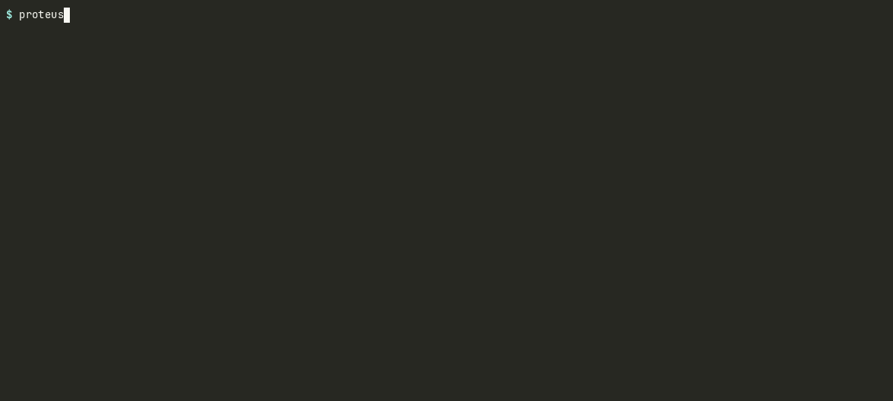
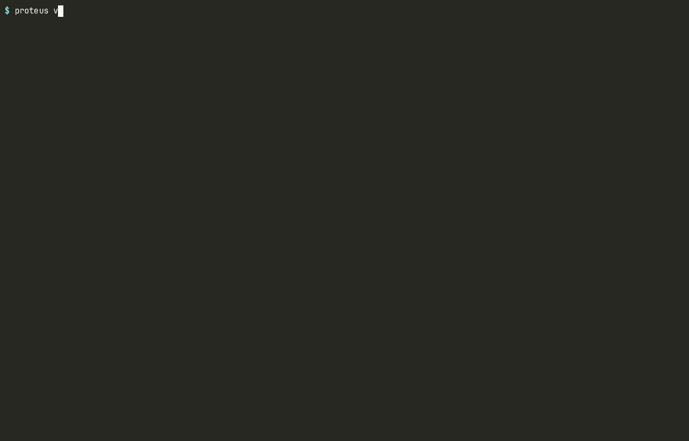
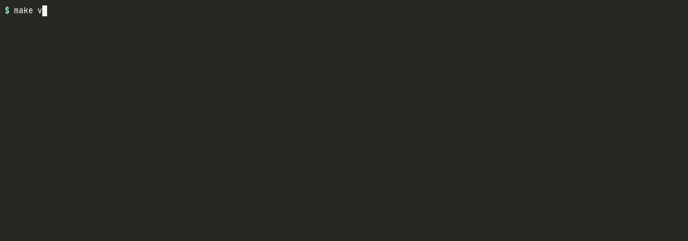
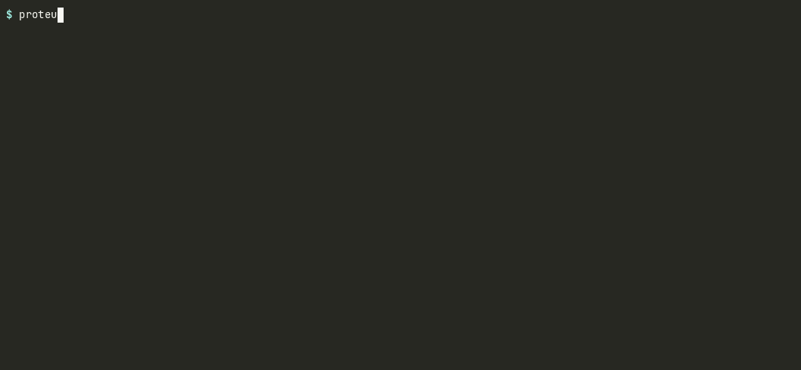

# proteus

[](https://github.com/OtoYuki/proteus/actions/workflows/ci.yml)
[](https://github.com/OtoYuki/proteus/actions/workflows/validate.yml)
[](https://github.com/OtoYuki/proteus/actions/workflows/tes-conformance.yml)
[](https://github.com/OtoYuki/proteus/releases)
[](Cargo.toml)
[](#license)

**The protein-engineering design loop as one binary, with a GA4GH TES server in it.**

Every stage of that loop already has a good tool. Boltz folds, mdtraj and FreeSASA measure,
PyMOL draws. What is usually missing is the seam between them: the glue that carries a scaffold
through mutagenesis, folding, all-atom validation, ranking and a columnar dataset without a pile
of one-off Python that nobody keeps. Proteus is that seam.

It does two things the tools it sits between mostly do not. It refuses to rank a structure it
could not really predict, and it checks every scientific number it prints against an
implementation someone else wrote, on every push.

---

## 1. Mutate, fold, rank, export



```bash
proteus mutate wt.fasta --mode alanine --start 24 --end 29 \
  | proteus screen - --runner esm-api --top 5 --export library.parquet
```

One pipe, no intermediate files. `mutate` writes a variant library (alanine scan or full
site-saturation); `screen -` reads it from stdin, folds each variant, runs the whole biophysics
stack on the result and ranks them.

The ranking is a triage filter, not a fitness predictor. It is checked on one thing only — that
a folded structure outranks a broken one (40/40 native-vs-decoy pairs, in `make validate`) — and
it is not validated against experimental stability or activity. For a sequence-level signal use
`--scorer esm2`, which ranks by ESM-2 likelihood instead, or `--scorer hybrid` for both.

Structures the offline simulator produced are tagged `engine = simulated` and kept out of the
leaderboard unless you pass `--runner simulated`. A tier that silently fell back tells you which
tier you asked for and why it could not honour it. Every export row carries the `engine` column;
the Parquet file is tagged `proteus.schema_version = 4` and reads directly into DuckDB, Polars
or PyArrow.

## 2. Triage a folder of predicted models

```bash
proteus analyze models/ --export qc.parquet          # every .pdb/.cif(.gz) below models/
proteus analyze designs/*.cif --reference target.pdb --json | jq .rmsd_to_reference
```

A folding or design campaign ends with a directory of hundreds or thousands of models and the
question of which ones are worth looking at. `analyze` over a directory gives one row per
structure — sequence, chain and residue counts, pLDDT (only when the file really carries one),
DSSP composition and string, MolProbity-contour Ramachandran, SASA and burial, heavy-atom
overlaps, the interaction network, Rg against the folded-protein law, optional Kabsch RMSD to a
reference, and the triage score — computed in parallel and written as Parquet, CSV or JSON.

```sql
-- duckdb
SELECT model, plddt_mean, rama_outliers, rg_ratio
FROM 'qc.parquet'
WHERE plddt_mean > 80 AND rama_outliers = 0 AND rg_ratio < 1.3
ORDER BY fitness DESC;
```

A file that cannot be read is named on stderr and makes the exit status non-zero, but does not
stop the rest. pLDDT is read from the B-factor column and rescaled when a predictor wrote it on
0–1 (ESMFold); on three AlphaFold DB models the per-structure mean matches the database's own
`globalMetricValue` to 0.01. 1 000 models of 76–142 residues take about 44 s on one core and
7 s on 16 threads (i7-11800H laptop, 8 cores; `-j` sets the thread count).

## 3. Look at it, over SSH



```bash
proteus view <job> --interactive --dashboard        # or a .pdb / .cif / .cif.gz path
proteus view structure.pdb --backend sixel          # a still, for a CI log
proteus view mutant.pdb --compare wildtype.pdb      # superposed, with Kabsch RMSD
```

A software rasteriser, a cartoon ribbon and a telemetry dashboard, in the terminal. No X11
forwarding, no WebGL, no headless display server — which is the situation you are in on a
cluster login node.

The ribbon is built from cubic Hermite splines through the Cα trace, with its wide face oriented
by the backbone carbonyl and flip-corrected (Carson & Bugg 1986), so β-strands lie flat in their
sheet and show the sheet's real twist. Parallel-transport frames are the fallback for Cα-only
traces. Elliptic cross-sections, Richardson β-arrowheads, SSAO, cel-outlines, disulfide sticks.

Two things separate it from the other terminal viewers:

- **It computes secondary structure rather than reading it.** Strip the `HELIX`/`SHEET` records
  from a file and the picture does not change, because the assignment comes from Kabsch–Sander
  DSSP on the coordinates. Predicted structures never carry those records, so this is the case
  the tool exists for. Pinned by
  `secondary_structure_survives_a_file_that_does_not_declare_it`.
- **It says when the picture cannot show what you asked for.** At 3.4 Å per pixel, consecutive
  residues 3.8 Å apart cannot be separated, so `view` prints the resolution and points at a
  finer backend instead of letting an outline read as detail.

Backends: ANSI 24-bit half-block (1×2 px/cell), Braille (2×4 dots/cell), **DEC Sixel** (xterm,
mlterm, foot, contour, WezTerm, Windows Terminal) and the kitty graphics protocol. Sixel is
6–21× cheaper on the wire than kitty at the same resolution, which is what you want over SSH,
and its encoder is round-tripped through libsixel's own decoder in CI rather than eyeballed.

Keys: arrows or `hjkl` orbit, `+`/`-` zoom, `Space` spin, `Tab` dashboard, `c` colour scheme,
`o` SSAO and outlines, `d` disulfides, `r` reset camera, `q` quit.

## 4. Check every number against someone else's implementation



```bash
make validate     # 53 structures: X-ray, NMR, cryo-EM, AlphaFold-DB; PDB and mmCIF
```

This runs on every push (`.github/workflows/validate.yml`). Tolerances are the contract, in
`validate/tolerances.toml`; the full table for the last run lands in `validate/last_run.md`.

| what | reference | result |
|---|---|---|
| φ/ψ, Cα radius of gyration, Kabsch RMSD | mdtraj | every angle within 0.1° |
| Kabsch–Sander DSSP (`proteus-dssp`) | mdtraj | ≥ 98 % per residue |
| MolProbity Ramachandran (Top8000 contours) | cctbx `ramalyze` | 100 % label agreement |
| Shrake–Rupley SASA (Bondi radii, 960 pts) | mdtraj, FreeSASA | ≤ 1 % vs mdtraj, ≤ 4 % vs FreeSASA (L&R, ProtOr radii) |
| hydrogen-bond network | mdtraj `baker_hubbard`, six NMR entries with explicit H | recall 86–100 %, precision 58–76 % — heavy-atom criteria over-detect by 1.3–1.7× |
| salt bridges, π–π stacking, cation–π | PLIP, intra-chain, 15 structures | salt bridges **97.7 %** precision / 72 % recall; π–π **81.8 / 81.8 %**; cation–π **73.9 / 65.4 %** |
| heavy-atom steric overlap | none exists with these definitions | labelled as ours, not compared |

Precision sits next to recall even where precision is the unflattering number. The salt-bridge
cutoff is deliberately stricter than PLIP's (4.0 Å atom-to-atom against 5.5 Å centre-to-centre),
so reporting a subset of PLIP's is the intent; 97.7 % precision is the evidence that it is the
right subset. Where a per-structure divergence is real and understood it is recorded in
`validate/tolerances.toml` with a written reason and printed on every run, rather than hidden by
widening a global tolerance.

Adopting each of these references found something internal testing had not. PLIP found π–π
stacking over-reported 5× for want of a lateral-offset test. Growing the corpus found the
comparison harness itself silently collapsing insertion codes, so residues 52 and 52A were being
compared as one.

## 5. Drive it from a workflow engine



```bash
proteus serve --port 8080 --auth-token "$TOKEN" \
  --allow-image 'ghcr.io/otoyuki/*' --allow-dir "$PWD/work"
nextflow run examples/nextflow/screening.nf      # or: sprocket run … examples/wdl/analyze.wdl
```

`proteus serve` is a **GA4GH TES 1.1** server: a single binary talking to the host's
Podman or Docker socket. It passes the ELIXIR `openapi-test-runner` compliance suite, 23/23 test
cases and 187 assertions, run in CI against a real container executor rather than a mock.

Tasks run inside their own container image with `resources` enforced. `--auth-token`,
`--allow-image` and `--allow-dir` are the lockdown; `file://` input and output URLs may only
point inside an `--allow-dir` directory and everything else is rejected with 400. See
[SECURITY.md](SECURITY.md) for what is and is not covered.

Two workflow examples ship with the repo. The Sprocket (WDL) one runs in CI; the Nextflow one
(Nextflow 26 + nf-ga4gh 1.5) is exercised by hand and is what the recording above shows.
[`examples/wdl/README.md`](examples/wdl/README.md) describes what crosses the wire.
Swagger UI is at `/swagger-ui`, Prometheus metrics at `/metrics`.

---

## Where this sits next to other tools

Proteus is not the only Rust implementation of any one of its parts.

| if you want | use |
|---|---|
| a TES server for a **Kubernetes cluster** | [planetary](https://github.com/stjude-rust-labs/planetary) (St. Jude Rust Labs). Proteus is the single-binary-against-a-local-socket model, which is the other deployment shape, not a better one |
| structure parsing, BinaryCIF, density maps, **Python/C bindings** | [molex](https://github.com/foldit-org/molex) |
| ESM **embeddings** across CUDA and MLX backends | [esm-rs](https://github.com/tcztzy/esm-rs). Proteus's ESM work is variant-effect scoring, not representation |
| a terminal viewer with iTerm2 support and more polish | [ProteinView](https://github.com/001TMF/ProteinView) |
| interactive analysis in a browser | [Mol\*](https://molstar.org), which Proteus does not try to replace |

**What this is not.** Not a folding engine — it orchestrates ESMFold and Boltz rather than
predicting structure itself, and no prediction image is published (build or pull one and point
`PROTEUS_IMAGE_FAST` / `PROTEUS_IMAGE_SOTA` at it). Not a replacement for Mol\*, PyMOL or
ChimeraX for interactive analysis. The terminal viewer is not unusual any more: ProteinView,
[StrucTTY](https://github.com/steineggerlab/StrucTTY) and
[pixelfold](https://github.com/fuyu-myk/pixelfold) all render structures in a terminal.

What is actually unoccupied is narrower than any of those: the whole loop in one binary that
runs against a local container socket, with every number it prints checked against someone
else's implementation.

## Speed

Same metric, same file, median wall-clock. Full table in [`bench/README.md`](bench/README.md).

| | vs |
|---|---|
| SASA, equal point count | 2.3–4.7× mdtraj's C++ kernel, ~33× Biopython |
| DSSP | 1.3–12× mdtraj |
| φ/ψ + Ramachandran | 33–159× mdtraj's φ/ψ API |

6VXX (22 812 atoms), full profile: 0.69 s. Crambin: ~8 ms.

## Install

```bash
# release binaries (Linux x86_64/aarch64, macOS x86_64/arm64)
curl -L https://github.com/OtoYuki/proteus/releases/latest/download/proteus-x86_64-unknown-linux-gnu.tar.gz | tar xz

# from source (Rust 1.94+); the binary is not on crates.io — that name is an unrelated project
cargo install --git https://github.com/OtoYuki/proteus proteus-cli

# container: the CLI works as is; `serve` needs the host's container socket for TES executors
podman run --rm -v "$PWD:/w" ghcr.io/otoyuki/proteus analyze --pdb /w/structure.pdb
podman run --rm -p 8080:8080 -v /run/user/$(id -u)/podman/podman.sock:/var/run/docker.sock \
  -v proteus-data:/data ghcr.io/otoyuki/proteus serve --host 0.0.0.0 --allow-dir /data
```

---

## The crates

A Cargo workspace of eight. Two of them depend on nothing else here and are meant to be used on
their own; the other six are the application, and ship as the `proteus` binary.

```
crates/
├── proteus-dssp/       Kabsch–Sander DSSP, 8-state. Zero dependencies. Standalone.
├── proteus-esm/        ESM-2 masked-LM inference on candle. Standalone.
├── proteus-core/       Domain models, FASTA, DMS mutagenesis, all-atom biophysics
├── proteus-storage/    SQLite (SQLx WAL), BLAKE3 CAS, Parquet/CSV/JSON export
├── proteus-engine/     Async scheduler, prediction runners, TES task execution (bollard)
├── proteus-render/     Software 3D rasteriser, ribbon extruder, TUI dashboard
├── proteus-server/     Axum daemon: GA4GH TES 1.1, native API, SSE, OpenAPI
└── proteus-cli/        The binary: mutate, screen, analyze, view, esm, submit, serve
```

The application crates are not published to crates.io, because `proteus-engine` and
`proteus-cli` are taken there by unrelated projects. Install the binary from the releases, the
ghcr image, or `cargo install --git`.

## What the biophysics actually computes

All-atom, pure Rust, O(N) through spatial cell lists.

- **Hydrogen bonds** — Baker–Hubbard heavy-atom antecedent criteria, backbone and sidechain.
- **Salt bridges** — ≤ 4.0 Å between basic cations and acidic anions.
- **π–π stacking** — parallel-displaced and T-shaped edge-to-face, with a 2.0 Å lateral ring
  offset test (McGaughey 1998).
- **Cation–π** — ≤ 6.0 Å with the cation within 45° of the ring normal.
- **SASA** — Shrake–Rupley, 960-point Fibonacci sphere per atom, Bondi radii (mdtraj's default).
- **Ramachandran** — the six Top8000 percentile contour grids (general, Gly, cis-Pro, trans-Pro,
  pre-Pro, Ile/Val) converted from cctbx, with MolProbity's Favored ≥ 2 % and
  Allowed ≥ 0.05–0.2 % thresholds.
- **Secondary structure** — `proteus-dssp`, eight states from backbone H-bond energies
  (α/3₁₀/π helices, bridges, ladders, bends, turns), plus a three-state reduction.
- **Steric overlap** — severe heavy-atom overlaps (> 0.40 Å) per 1000 atoms, Bondi vdW radii,
  with covalent exclusions for intra-residue bonding, peptide linkages, proline ring geometry
  and disulfides. This is **not** the MolProbity clashscore, which adds hydrogens with Reduce
  first. It under-counts on deposited structures and is meant as a relative screen for grossly
  overlapping predicted models.
- **Superposition** — Kabsch, via SVD on the 3×3 covariance matrix (`nalgebra`).

## ESM-2, in pure Rust

`proteus-esm` re-implements `EsmForMaskedLM` on
[candle](https://github.com/huggingface/candle). No Python, no PyTorch, one static binary. It
loads any `facebook/esm2_*` checkpoint and produces zero-shot mutation scores — wild-type or
masked marginals, following Meier et al. 2021 — and full deep mutational scans.

```bash
proteus esm score wildtype.fasta --mutations P19A,C4S --esm-masked
proteus esm scan wildtype.fasta --export scan.csv     # 20×L matrix + a terminal heat map
proteus mutate wt.fasta --mode saturation | proteus screen - --scorer hybrid --export lib.parquet
```

- **Parity**: logits within 1e-2 and amino-acid log-probabilities within 5e-3 of
  `transformers.EsmForMaskedLM` (fp32), on three proteins × two checkpoints, pinned in CI
  against committed reference values.
- **Accuracy on real data**: ProteinGym v1.1 Spearman ρ over the five smallest single-mutant
  assays — mean |ρ| 0.42 with `esm2_t12_35M`, 0.24 with `esm2_t6_8M`
  ([`bench/README.md`](bench/README.md)).
- **Where it is known to be unreliable**, from the published benchmarks rather than ours:
  zero-shot ESM-2 is a reasonable triage signal for human and microbial proteins and a poor one
  for viral proteins and long multi-domain sequences. `proteus esm` says so when it runs past
  400 residues.
- ESM-2 rather than ESM-3 because ESM-3's weights are non-commercial. ESM C 300M is
  MIT-licensed and is the natural next checkpoint.

---

## Command reference

Jobs are referred to by UUID or by any unique prefix of one, the way git handles commits. The
leaderboard prints the first eight characters; `proteus view 0916a5e6` resolves it.

### `proteus mutate` — variant libraries

```bash
proteus mutate scaffold.fasta --mode alanine --output library.fasta
proteus mutate scaffold.fasta --mode saturation --start 10 --end 18 --max-variants 50
```

`alanine` substitutes alanine across a window; `saturation` substitutes all 20 canonical amino
acids. Write to a file with `--output`, or leave it out and pipe into `screen -`.

### `proteus screen` — the funnel

```bash
proteus screen library.fasta --tier fast --workers 8 --min-plddt 75 --top 10 \
  --export results.parquet
proteus mutate wt.fasta --mode alanine | proteus screen - --export results.parquet
```

`--runner` picks where folding happens: `oci` (a local container image), `esm-api` (the Meta
ESMFold API), `simulated` (an offline placeholder helix), or `auto`, which tries them in that
order. `--export` takes `.parquet`, `.csv` or `.json`; anything else is refused rather than
guessed at.

### `proteus view` — the viewer

```bash
proteus view structure.pdb --interactive --dashboard
proteus view structure.pdb --backend halfblock --color ss --width 80 --height 36
proteus view structure.pdb --backend sixel        # or braille, or kitty
proteus view mutant.pdb --compare wildtype.pdb --interactive
proteus view structure.pdb --html out.html        # a self-contained 3Dmol.js page, works offline
```

### `proteus analyze` — one structure in full, or a table over many

```bash
proteus analyze structure.pdb                          # the full report, below
proteus analyze models/ --export qc.parquet            # one row per file: .parquet, .csv, .json
proteus analyze a.pdb b.cif.gz --json                  # JSON Lines on stdout
proteus analyze models/ --reference wt.pdb -j 8 --top 50
```

Directories are searched recursively for `.pdb`, `.ent`, `.cif` and `.mmcif`, each optionally
gzipped. `--confidence-source predicted|experimental` overrides the pLDDT-vs-B-factor detection.
The Parquet file is tagged `proteus.qc_schema_version = 1`.

1CRN (crambin). It is an X-ray structure, so no pLDDT is reported — the B-factor column is not
a confidence and Proteus will not pretend it is:

```
┌──────────────────────────────────────────┬───────────────────────────────────────────────────────────────────┐
│ Biophysical Metric                       ┆ Value                                                             │
╞══════════════════════════════════════════╪═══════════════════════════════════════════════════════════════════╡
│ Radius of Gyration (Rg)                  ┆ 9.676 Å                                                           │
├╌╌╌╌╌╌╌╌╌╌╌╌╌╌╌╌╌╌╌╌╌╌╌╌╌╌╌╌╌╌╌╌╌╌╌╌╌╌╌╌╌╌┼╌╌╌╌╌╌╌╌╌╌╌╌╌╌╌╌╌╌╌╌╌╌╌╌╌╌╌╌╌╌╌╌╌╌╌╌╌╌╌╌╌╌╌╌╌╌╌╌╌╌╌╌╌╌╌╌╌╌╌╌╌╌╌╌╌╌╌┤
│ Contact Density (C-alpha <= 8Å)          ┆ 9.86%                                                             │
├╌╌╌╌╌╌╌╌╌╌╌╌╌╌╌╌╌╌╌╌╌╌╌╌╌╌╌╌╌╌╌╌╌╌╌╌╌╌╌╌╌╌┼╌╌╌╌╌╌╌╌╌╌╌╌╌╌╌╌╌╌╌╌╌╌╌╌╌╌╌╌╌╌╌╌╌╌╌╌╌╌╌╌╌╌╌╌╌╌╌╌╌╌╌╌╌╌╌╌╌╌╌╌╌╌╌╌╌╌╌┤
│ pLDDT                                    ┆ n/a (experimental structure; B-factor column is not a confidence) │
├╌╌╌╌╌╌╌╌╌╌╌╌╌╌╌╌╌╌╌╌╌╌╌╌╌╌╌╌╌╌╌╌╌╌╌╌╌╌╌╌╌╌┼╌╌╌╌╌╌╌╌╌╌╌╌╌╌╌╌╌╌╌╌╌╌╌╌╌╌╌╌╌╌╌╌╌╌╌╌╌╌╌╌╌╌╌╌╌╌╌╌╌╌╌╌╌╌╌╌╌╌╌╌╌╌╌╌╌╌╌┤
│ Secondary Structure Composition          ┆ α-Helix: 47.8% | β-Strand: 8.7% | Coil: 43.5%                     │
├╌╌╌╌╌╌╌╌╌╌╌╌╌╌╌╌╌╌╌╌╌╌╌╌╌╌╌╌╌╌╌╌╌╌╌╌╌╌╌╌╌╌┼╌╌╌╌╌╌╌╌╌╌╌╌╌╌╌╌╌╌╌╌╌╌╌╌╌╌╌╌╌╌╌╌╌╌╌╌╌╌╌╌╌╌╌╌╌╌╌╌╌╌╌╌╌╌╌╌╌╌╌╌╌╌╌╌╌╌╌┤
│ Ramachandran Conformation                ┆ Favored: 97.7% | Allowed: 2.3% | Outliers: 0                      │
├╌╌╌╌╌╌╌╌╌╌╌╌╌╌╌╌╌╌╌╌╌╌╌╌╌╌╌╌╌╌╌╌╌╌╌╌╌╌╌╌╌╌┼╌╌╌╌╌╌╌╌╌╌╌╌╌╌╌╌╌╌╌╌╌╌╌╌╌╌╌╌╌╌╌╌╌╌╌╌╌╌╌╌╌╌╌╌╌╌╌╌╌╌╌╌╌╌╌╌╌╌╌╌╌╌╌╌╌╌╌┤
│ Solvent Accessible Surface Area          ┆ Total: 2973.4 Ų (Hydrophobic Burial: 92.8%)                      │
├╌╌╌╌╌╌╌╌╌╌╌╌╌╌╌╌╌╌╌╌╌╌╌╌╌╌╌╌╌╌╌╌╌╌╌╌╌╌╌╌╌╌┼╌╌╌╌╌╌╌╌╌╌╌╌╌╌╌╌╌╌╌╌╌╌╌╌╌╌╌╌╌╌╌╌╌╌╌╌╌╌╌╌╌╌╌╌╌╌╌╌╌╌╌╌╌╌╌╌╌╌╌╌╌╌╌╌╌╌╌┤
│ Heavy-atom steric overlap (>0.4 Å, no H) ┆ 0.0 per 1k atoms (0 overlaps)                                     │
├╌╌╌╌╌╌╌╌╌╌╌╌╌╌╌╌╌╌╌╌╌╌╌╌╌╌╌╌╌╌╌╌╌╌╌╌╌╌╌╌╌╌┼╌╌╌╌╌╌╌╌╌╌╌╌╌╌╌╌╌╌╌╌╌╌╌╌╌╌╌╌╌╌╌╌╌╌╌╌╌╌╌╌╌╌╌╌╌╌╌╌╌╌╌╌╌╌╌╌╌╌╌╌╌╌╌╌╌╌╌┤
│ Hydrogen Bonds (H-Bonds)                 ┆ 54 total (43 BB-BB, 10 BB-SC, 1 SC-SC)                            │
├╌╌╌╌╌╌╌╌╌╌╌╌╌╌╌╌╌╌╌╌╌╌╌╌╌╌╌╌╌╌╌╌╌╌╌╌╌╌╌╌╌╌┼╌╌╌╌╌╌╌╌╌╌╌╌╌╌╌╌╌╌╌╌╌╌╌╌╌╌╌╌╌╌╌╌╌╌╌╌╌╌╌╌╌╌╌╌╌╌╌╌╌╌╌╌╌╌╌╌╌╌╌╌╌╌╌╌╌╌╌┤
│ Ionic Salt Bridges (≤4.0Å)               ┆ 1 detected (closest: ARG17:NH2-GLU23:OE2 3.97Å)                   │
├╌╌╌╌╌╌╌╌╌╌╌╌╌╌╌╌╌╌╌╌╌╌╌╌╌╌╌╌╌╌╌╌╌╌╌╌╌╌╌╌╌╌┼╌╌╌╌╌╌╌╌╌╌╌╌╌╌╌╌╌╌╌╌╌╌╌╌╌╌╌╌╌╌╌╌╌╌╌╌╌╌╌╌╌╌╌╌╌╌╌╌╌╌╌╌╌╌╌╌╌╌╌╌╌╌╌╌╌╌╌┤
│ Aromatic π-π Stacking                    ┆ 0 conjugated pairs (0 parallel, 0 T-shaped)                       │
├╌╌╌╌╌╌╌╌╌╌╌╌╌╌╌╌╌╌╌╌╌╌╌╌╌╌╌╌╌╌╌╌╌╌╌╌╌╌╌╌╌╌┼╌╌╌╌╌╌╌╌╌╌╌╌╌╌╌╌╌╌╌╌╌╌╌╌╌╌╌╌╌╌╌╌╌╌╌╌╌╌╌╌╌╌╌╌╌╌╌╌╌╌╌╌╌╌╌╌╌╌╌╌╌╌╌╌╌╌╌┤
│ Cation-π Interactions                    ┆ 0 active interactions                                             │
├╌╌╌╌╌╌╌╌╌╌╌╌╌╌╌╌╌╌╌╌╌╌╌╌╌╌╌╌╌╌╌╌╌╌╌╌╌╌╌╌╌╌┼╌╌╌╌╌╌╌╌╌╌╌╌╌╌╌╌╌╌╌╌╌╌╌╌╌╌╌╌╌╌╌╌╌╌╌╌╌╌╌╌╌╌╌╌╌╌╌╌╌╌╌╌╌╌╌╌╌╌╌╌╌╌╌╌╌╌╌┤
│ Non-Covalent Network Density             ┆ 119.6 contacts / 100 res                                          │
├╌╌╌╌╌╌╌╌╌╌╌╌╌╌╌╌╌╌╌╌╌╌╌╌╌╌╌╌╌╌╌╌╌╌╌╌╌╌╌╌╌╌┼╌╌╌╌╌╌╌╌╌╌╌╌╌╌╌╌╌╌╌╌╌╌╌╌╌╌╌╌╌╌╌╌╌╌╌╌╌╌╌╌╌╌╌╌╌╌╌╌╌╌╌╌╌╌╌╌╌╌╌╌╌╌╌╌╌╌╌┤
│ Candidate Fitness Score                  ┆ 98.2 / 100                                                        │
└──────────────────────────────────────────┴───────────────────────────────────────────────────────────────────┘
```

### `proteus submit`, `status`, `inspect` — jobs

```bash
proteus submit --file wt.fasta --runner esm-api    # prints the job id
proteus status 0916a5e6                            # state, tier, timings
proteus inspect 0916a5e6                           # the full biophysical report
```

### `proteus serve` — the daemon

```bash
proteus serve --port 8080 --host 0.0.0.0 --auth-token "$TOKEN" \
  --allow-image 'ghcr.io/otoyuki/*' --allow-dir /srv/tes-store
```

---

## Building and checking it yourself

```bash
cargo build --release                                  # target/release/proteus
cargo test --workspace                                 # unit, integration and doc tests
cargo clippy --workspace --all-targets -- -D warnings
cargo fmt --check
scripts/smoke.sh                                       # every command end to end, with assertions
scripts/smoke.sh --tes IMAGE                           # …and a real TES task in a container
make validate                                          # the 53-structure corpus (needs uv, ~50 MB once)
bench/run.sh                                           # criterion + mdtraj/FreeSASA/Biopython
```

Needs Rust 1.94 or newer. A container runtime is optional: a rootless Podman socket
(`systemctl --user enable --now podman.socket`) or a Docker daemon, for the OCI runner and TES
executors.

---

## How the numbers are defined

### Radius of gyration

$$\mathbf{r}_{\text{cm}} = \frac{1}{N}\sum_{i=1}^N \mathbf{r}_i \quad\text{over all } C_\alpha\text{ atoms}$$

$$R_g = \sqrt{\frac{1}{N}\sum_{i=1}^N \|\mathbf{r}_i - \mathbf{r}_{\text{cm}}\|^2}$$

### Kabsch superposition (Cα RMSD)

For centred coordinate matrices $P, Q \in \mathbb{R}^{N \times 3}$:

1. Cross-covariance: $H = P^T Q$.
2. SVD: $H = U \Sigma V^T$.
3. Correct for reflection:
   $$R = V \begin{pmatrix} 1 & 0 & 0 \\ 0 & 1 & 0 \\ 0 & 0 & \det(V U^T) \end{pmatrix} U^T$$
4. $\text{RMSD} = \sqrt{\frac{1}{N}\sum_{i=1}^N \|R \mathbf{p}_i - \mathbf{q}_i\|^2}$

### Heavy-atom steric overlap

$$\text{Clash}_{1k} = \frac{\sum_{i < j} \mathbb{I}\left(r_i^{\text{vdW}} + r_j^{\text{vdW}} - d_{ij} > 0.40\text{ \AA}\right)}{N_{\text{atoms}}} \times 1000$$

Excluding atoms in the same residue, backbone peptide linkages and proline ring geometry
($|res_i - res_j| = 1$ in the same chain), and disulfide-bonded sulfur pairs
($d(S_\gamma, S_\gamma) \in [1.70, 2.60]$ Å).

### Non-covalent interactions

- **Baker–Hubbard hydrogen bonds:**
  $$2.4\,\text{Å} \le d(D, A) \le 3.5\,\text{Å}, \quad \theta(D_{\text{ante}}-D\cdots A) \ge 90^\circ, \quad \theta(A_{\text{ante}}-A\cdots D) \ge 90^\circ$$
- **Salt bridges:**
  $$d(\text{cation}, \text{anion}) \le 4.0\,\text{Å} \quad\text{with}\quad (chain, res)_{\text{cat}} \neq (chain, res)_{\text{ani}}$$
- **π–π stacking**, centroids $\mathbf{c}_i$ with ring normals $\mathbf{n}_i$, lateral offset ≤ 2.0 Å:
  $$d(\mathbf{c}_1, \mathbf{c}_2) \le 6.5\,\text{Å}, \quad \theta = \arccos(|\mathbf{n}_1 \cdot \mathbf{n}_2|) \implies \begin{cases} \text{parallel} & \theta \le 30^\circ \\ \text{T-shaped} & 60^\circ \le \theta \le 120^\circ \end{cases}$$
- **Cation–π:**
  $$d(\text{cation}, \mathbf{c}) \le 6.0\,\text{Å}, \quad \cos\alpha = \frac{|\mathbf{n} \cdot (\mathbf{r}_{\text{cat}} - \mathbf{c})|}{\|\mathbf{r}_{\text{cat}} - \mathbf{c}\|} \ge \frac{1}{\sqrt{2}}$$

### Composite fitness score

$$S_{\text{fitness}} = 0.30 \cdot \text{pLDDT} + 0.20 \cdot S_{\text{compactness}} + 0.15 \cdot f_{\text{favored}} + 0.15 \cdot f_{\text{burial}} + 0.20 \cdot B_{\text{network}} - P_{\text{clash}}$$

$S_{\text{compactness}}$ compares $R_g$ against the empirical folded-protein law
$2.2\,N^{0.38}$ Å. The network term rewards secondary and tertiary contacts:

$$B_{\text{network}} = \min\left(100,\; 100 \cdot \frac{0.5 N_{\text{bb}} + 1.0 N_{\text{sc-hbond}} + 2.5 N_{\text{salt}} + 2.0 N_{\pi\text{-}\pi} + 2.0 N_{\text{cat-}\pi}}{0.60 \cdot N_{\text{res}}}\right)$$

For an experimental structure $w_{\text{pLDDT}} = 0$ and the other four weights are divided by
$0.70$.

---

## Provenance

The Rust rewrite was written over a few days in September 2026 with heavy AI assistance, and
`git log` shows it: most of the commits land in one week. Velocity like that is a reason to
check the work rather than trust it, so the work is set up to be checked.

```bash
make validate
```

Every scientific number is compared, structure by structure, against an implementation written
by someone else, and the comparison runs on every push. Where no reference implementation exists
the table above says so on the row rather than implying more validation than there is.
`scripts/smoke.sh` exercises every command and the daemon end to end; the GA4GH TES compliance
suite runs against the daemon in CI; the ESM-2 implementation is checked against `transformers`
on every push.

That does not make the code good. It makes the claims falsifiable by a stranger in one command,
which is the part that matters when nobody is going to audit 12 000 lines by eye.

The Python/Django/Celery undergraduate thesis prototype this grew out of (2025) is preserved
under the git tag `v0.1.0-thesis`. Everything at the repository root is Rust.

---

## License

Either of:

- Apache License, Version 2.0 ([LICENSE-APACHE](LICENSE-APACHE) or <http://www.apache.org/licenses/LICENSE-2.0>)
- MIT license ([LICENSE-MIT](LICENSE-MIT) or <http://opensource.org/licenses/MIT>)

at your option.
