<div align="center">

<h1>
  <picture>
    <source media="(prefers-color-scheme: dark)" srcset="docs/brand/proteus-lockup-dark.svg">
    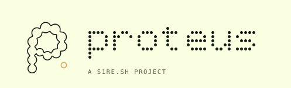
  </picture>
</h1>

**Triage for protein design campaigns: which of your models deserve a GPU-hour, a wet-lab slot
or a closer look. One binary, no Python, no Rosetta licence.**

[](https://github.com/OtoYuki/proteus/actions/workflows/ci.yml)
[](https://github.com/OtoYuki/proteus/actions/workflows/validate.yml)
[](https://github.com/OtoYuki/proteus/actions/workflows/tes-conformance.yml)
[](https://github.com/OtoYuki/proteus/releases/latest)
[](#license)
[](Cargo.toml)

</div>

A binder or design campaign ends with thousands of predicted models. Choosing among them usually
means a local script over Biopython, mdtraj, FreeSASA and PyRosetta: a licence to buy for
commercial use, an environment to keep alive, and numbers that are rarely compared with anything.

`proteus analyze` measures every model in a folder in parallel and writes one row per model to
Parquet, CSV or JSON. It covers confidence, secondary structure, MolProbity's geometry checks,
contacts and, for complexes, the binder–target interface, read together with the PAE and scores
your predictor wrote beside each model. Every measurement that has a reference implementation is
checked against it on every push: mdtraj, cctbx (MolProbity), FreeSASA, PLIP and sc-rs. The
interface ranking is also measured against a published dataset of 3 669 designs whose binding
was tested in the lab. Numbers that have no reference are labelled as unchecked.

<picture>
  <source media="(prefers-color-scheme: dark)" srcset="docs/img/per-target-dark.svg">
  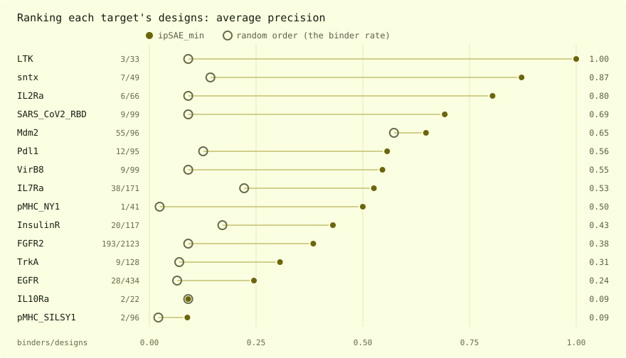
</picture>

<sub>Proteus's <code>ipsae_min</code> on the AlphaFold 3 models of the 3 669 designs in Overath et al.
2025, ranked within each target. A filled dot is the ranking's average precision, the ring is what
a random order scores (the target's binder rate). Drawn from
<a href="validate/binders/last_run.md"><code>validate/binders/last_run.md</code></a> by
<code>proteus_render::brand::figures</code>; a test fails if the picture and the report disagree.</sub>

## Contents

- [In a minute](#in-a-minute) · [How it works](#how-it-works)
- [1. Triage a binder campaign](#1-triage-a-binder-campaign)
- [2. Triage any folder of predicted models](#2-triage-any-folder-of-predicted-models)
- [3. Check every number against someone else's implementation](#3-check-every-number-against-someone-elses-implementation)
- [4. Look at it, over SSH](#4-look-at-it-over-ssh)
- [5. Make the models: mutate, fold, rank](#5-make-the-models-mutate-fold-rank)
- [6. Drive it from a workflow engine](#6-drive-it-from-a-workflow-engine)
- [Where this sits next to other tools](#where-this-sits-next-to-other-tools) · [Speed](#speed) · [Install](#install)
- [Command reference](#command-reference) · [How the numbers are defined](#how-the-numbers-are-defined) · [Provenance](#provenance)

## In a minute

```bash
curl -L https://github.com/OtoYuki/proteus/releases/latest/download/proteus-x86_64-unknown-linux-gnu.tar.gz | tar xz
./proteus analyze boltz_results/ --interface A --export triage.parquet  # a binder campaign, one row per model
./proteus analyze models/ --export qc.parquet                           # any folder of predicted models
./proteus analyze model.pdb                                             # every measurement, one structure
./proteus view model.pdb --web                                          # look at it, in a browser or the terminal
```

Other platforms, `cargo install` and the container image are under [Install](#install).

## How it works

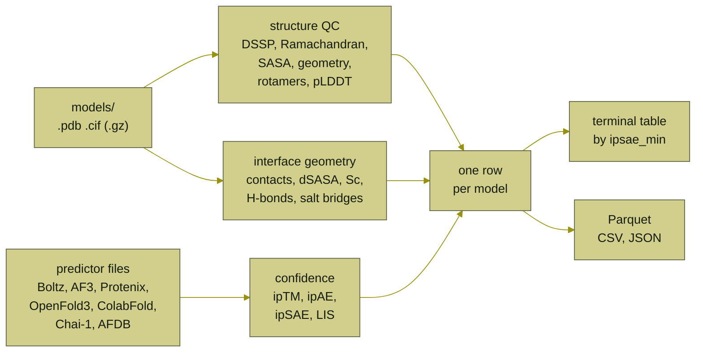
```mermaid
%%{init: {"theme": "base", "themeVariables": {"fontFamily": "Geist Mono, ui-monospace, monospace", "primaryColor": "#D1CF8B", "primaryTextColor": "#141C10", "primaryBorderColor": "#5A6042", "lineColor": "#99920B", "secondaryColor": "#FBFFE1", "tertiaryColor": "#FBFFE1"}}}%%
flowchart LR
    M["models/<br/>.pdb .cif (.gz)"] --> S["structure QC<br/>DSSP, Ramachandran,<br/>SASA, geometry,<br/>rotamers, pLDDT"]
    M --> I["interface geometry<br/>contacts, dSASA, Sc,<br/>H-bonds, salt bridges"]
    C["predictor files<br/>Boltz, AF3, Protenix,<br/>OpenFold3, ColabFold,<br/>Chai-1, AFDB"] --> Q["confidence<br/>ipTM, ipAE,<br/>ipSAE, LIS"]
    S --> R["one row<br/>per model"]
    I --> R
    Q --> R
    R --> T["terminal table<br/>by ipsae_min"]
    R --> E["Parquet<br/>CSV, JSON"]
```

Models are measured in parallel (`-j` sets the thread count). A file that cannot be read is named
on stderr and makes the exit status non-zero without stopping the rest. The structure
measurements are compared with mdtraj, cctbx, FreeSASA, PLIP and sc-rs on every push (section 3);
the interface ranking is compared with lab results by `make validate-binders` (section 1).

---

## 1. Triage a binder campaign

```bash
proteus analyze boltz_results/ --interface A:B --export triage.parquet
```

`--interface` names the binder and the target: `A:B`, `H,L:A` for a two-chain binder, or `A` for
chain A against every other chain. For every model it adds two groups of columns.

- **From the structure:** interface residues on each side (heavy atoms within 4 Å, BindCraft's
  cutoff), buried surface (dSASA), shape complementarity (Sc, Lawrence & Colman 1993), and
  hydrogen bonds and salt bridges across the interface.
- **From the predictor's own files beside the model:** ipTM, ipAE, ipSAE and LIS. Proteus reads
  Boltz, AlphaFold 3 (local runs and the AlphaFold Server), Protenix, OpenFold3, ColabFold and
  AlphaFold DB files, and Chai-1's scores (see [`analyze`](#proteus-analyze--one-structure-in-full-or-a-table-over-many)).
  ipSAE (Dunbrack 2025) is the pTM-style score over only the residue pairs the predictor is
  confident about. It is reported both ways round, binder→target and target→binder, and
  `ipsae_min` is the smaller of the two.

The terminal table sorts by `ipsae_min`, the export has every column, and the rest of the
per-model QC (section 2) comes with it. Here is the result on twelve designs against IL-7Rα,
drawn at random from the dataset below, with some columns left out (the terminal also shows
pLDDT, contact counts, H-bonds, salt bridges and bond RMSZ). The last column is the lab result,
which Proteus never sees:

| model | ipsae_min | iptm | ipae | lis | interface_sc | interface_dsasa | bound in the lab |
|---|---:|---:|---:|---:|---:|---:|:-:|
| `il7ra_binder_af2_48` | 0.698 | 0.87 | 5.1 | 0.613 | 0.57 | 1983 | **yes** |
| `il7ra_binder_af2_34` | 0.646 | 0.89 | 5.0 | 0.633 | 0.70 | 1758 | no |
| `il7ra_binder_af2_93` | 0.622 | 0.86 | 5.6 | 0.605 | 0.60 | 1610 | no |
| `il7ra_binder_af2_94` | 0.587 | 0.88 | 4.8 | 0.650 | 0.70 | 1519 | no |
| `longxing_grafting2_ems_3hc_242_…` | 0.548 | 0.85 | 6.2 | 0.549 | 0.61 | 1653 | no |
| `il7ra_binder_af2_65` | 0.505 | 0.81 | 6.0 | 0.549 | 0.57 | 1887 | no |
| `il7ra_binder_af2_51` | 0.159 | 0.68 | 9.7 | 0.322 | 0.58 | 1194 | no |
| `longxing_hhh_eva_0366_…` | 0.015 | 0.45 | 14.8 | 0.156 | 0.58 | 1659 | no |
| `longxing_grafting2_ems_3hc_306_…` | 0.014 | 0.42 | 15.2 | 0.159 | 0.62 | 1594 | no |
| `il7ra_binder_af2_72` | 0.011 | 0.27 | 19.4 | 0.066 | 0.47 | 1389 | no |
| `bcov_r3_ems_ferrm_5651_…` | 0.000 | 0.28 | 20.9 | 0.004 | 0.50 | 1181 | no |
| `longxing_ems_3hm_2137_…` | 0.000 | 0.26 | 20.5 | 0.018 | 0.57 | 1220 | no |

The one design that bound comes first, but this is one draw of twelve and proves little on its
own. Five that did not bind sit close behind it, and Sc would have put it eighth. What the score
is worth over thousands of designs is below.

To look at one model, open it with `proteus view model.cif --web`. A complex opens coloured by
interface: the binder in clay and the target in tide, bright where they touch and dark
elsewhere. An interface panel gives the verdict against the 0.61 ipSAE_min threshold, then the
numbers above. `i` selects both sides' contact residues and draws them as sticks, and `b` (or
the chips in the panel) hands the binder role to another chain. The terminal viewer's dashboard
shows the same three lines.

### What these numbers are worth

Measured on the 3 669 designs in the Overath et al. 2025 meta-analysis whose binding was tested
in the lab (394 bound, 15 targets), using the AlphaFold 3 models (`make validate-binders`). A
campaign ranks its own designs against one target, so the score is average precision (AP) per
target, averaged over the 15. A random ranking scores the binder rate, 0.131 on average.

<picture>
  <source media="(prefers-color-scheme: dark)" srcset="docs/img/scores-dark.svg">
  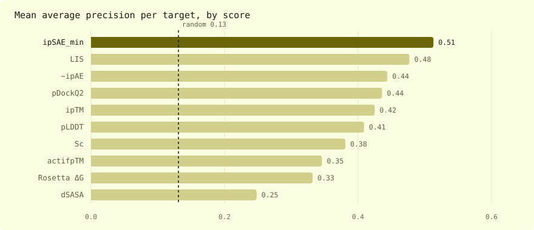
</picture>

| ranked by | AP per target | AUROC | |
|---|---|---|---|
| `ipsae_min` | **0.513** | 0.803 | 3.9× random; the dataset's own ipSAE_min: 0.513 |
| `lis` | 0.477 | 0.808 | |
| `ipae` (lower first) | 0.444 | 0.791 | |
| `iptm` | 0.425 | 0.791 | pDockQ2 (dataset): 0.436 |
| `plddt_mean` | 0.409 | 0.730 | |
| `interface_sc` | 0.381 | 0.714 | the dataset's Rosetta Sc: 0.267, Rosetta ΔG: 0.332 |

It beats every other score in the dataset, pDockQ2, ColabFold's actifpTM (0.346) and Rosetta's
interface ΔG included. It is an enrichment filter, not a predictor: most top-ranked designs still
fail in the lab, and targets with one to three binders give noisy numbers. Ranking all
designs together instead (AP 0.358 against 0.107) mixes targets whose binder rates run from 2 % to
57 %, and mostly measures which targets are easy. The per-target table is in
[`last_run.md`](validate/binders/last_run.md).

Keeping `ipsae_min > 0.61`, the paper's threshold, keeps 509 of the 3 669 designs. 203 of those
bound: 40 % of what you would send to the lab, against 11 % unfiltered, and half of all the binders.

**A second, harder check**: the 1 196 designs of Adaptyv's Nipah binder competition (111 bound),
on the Boltz-2 models and PAE that ProteinBase publishes (`make validate-nipah`). ipSAE_min scores
AP 0.191 against a random 0.093 (AUROC 0.658). Boltz's interface pLDDT ties it on AP and does
better on AUROC (0.707), and Sc is close (0.179).
The margin is smaller because ipSAE had already chosen which designs were tested. The binder
rate still climbs steadily with the score, from 2.7 % below 0.2 to 38 % above 0.8
([`last_run.md`](validate/nipah/last_run.md)).

<picture>
  <source media="(prefers-color-scheme: dark)" srcset="docs/img/nipah-bins-dark.svg">
  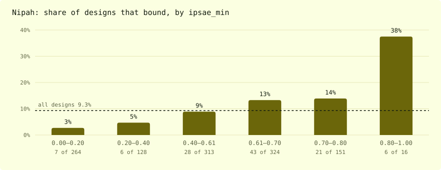
</picture>

```sql
-- duckdb: the confident interfaces, chemically sound, best first
SELECT model, ipsae_min, iptm, interface_sc, interface_dsasa, bond_outliers
FROM 'triage.parquet'
WHERE ipsae_min > 0.61 AND interface_sc > 0.6 AND handedness_swaps = 0
ORDER BY ipsae_min DESC;
```

On single-chain targets, ipTM, ipSAE and ipAE agree with the dataset's own values to its
three-decimal rounding (p99 |Δ| 0.0018). Sc is ported from sc-rs and equal to it to 1e-12.
Rosetta's interface ΔG, packstat and unsatisfied hydrogen bonds need an energy function and
explicit hydrogens, and are not computed. The differences from the dataset, and why they exist,
are in [`validate/binders/`](validate/binders/last_run.md).

## 2. Triage any folder of predicted models

```bash
proteus analyze models/ --export qc.parquet          # every .pdb/.cif(.gz) below models/
proteus analyze designs/*.cif --reference target.pdb --json | jq .rmsd_to_reference
```

A folding or design campaign ends with a directory of hundreds or thousands of models and the
question of which ones are worth looking at. `analyze` over a directory gives one row per
structure — sequence, chain and residue counts, pLDDT (only when the file really carries one),
DSSP composition and string, MolProbity-contour Ramachandran, SASA and burial, heavy-atom
overlaps, covalent geometry and rotamers, the interaction network, Rg against the
folded-protein law, optional Kabsch RMSD to a reference, and the triage score — computed in
parallel and written as Parquet, CSV or JSON.

The covalent-geometry columns are MolProbity's checks as Phenix runs them: bond-length and
bond-angle RMSZ and outliers against the Phenix restraint library (geostd, with the backbone
from the Conformation-Dependent Library), chirality and planarity, Cβ deviation, cis and
twisted peptides, and Top8000 rotamers. They reproduce cctbx residue by residue (section 3).
They answer a question pLDDT does not: whether the model is chemically sound. ESMFold, like
every AlphaFold2-style structure module, learns the peptide bond and returns the model
unrelaxed. Every one of 13 ESMFold models in the corpus has bond-length outliers, mostly short
peptide C–N bonds in residues it is confident about, and not one of them has any after an
AlphaFold2-style Amber relaxation that moves no Cα by more than 0.14 Å
([`validate/predicted/`](validate/predicted/README.md)).

```sql
-- duckdb
SELECT model, plddt_mean, rama_outliers, rg_ratio, bond_outliers, rotamer_outlier_pct
FROM 'qc.parquet'
WHERE plddt_mean > 80 AND rama_outliers = 0 AND rg_ratio < 1.3
  AND handedness_swaps = 0 AND cis_nonpro = 0
ORDER BY fitness DESC;
```

A file that cannot be read is named on stderr and makes the exit status non-zero, but does not
stop the rest. pLDDT is read from the B-factor column and rescaled when a predictor wrote it on
0–1 (ESMFold); on three AlphaFold DB models the per-structure mean matches the database's own
`globalMetricValue` to 0.01. 1 000 models of 76–142 residues take 39 s on one thread and 6 s on 16 (i7-11800H laptop, 8
cores; `-j` sets the thread count). With `--interface`, the 3 669 AlphaFold 3 complexes of the
binder dataset take about 3.5 minutes on 16 threads.

## 3. Check every number against someone else's implementation

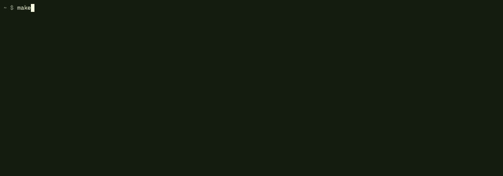

```bash
make validate     # 53 files, 48 entries: X-ray, NMR, cryo-EM, AlphaFold DB; PDB and mmCIF
```

This runs on every push (`.github/workflows/validate.yml`). Tolerances are the contract, in
`validate/tolerances.toml`; the full table for the last run lands in `validate/last_run.md`.

| what | reference | result |
|---|---|---|
| φ/ψ, Cα radius of gyration | mdtraj | every angle within 0.1°, Rg within 0.01 Å |
| Kabsch–Sander DSSP (`proteus-dssp`) | mdtraj | 99.6 % of 30 335 residues on eight states, 99.96 % on three; worst non-exempt file 97.8 % |
| MolProbity Ramachandran (Top8000 contours) | cctbx `ramalyze` | 100 % label agreement (collagen 1CAG has no reference: cctbx classifies none of its residues) |
| Shrake–Rupley SASA (Bondi radii, 960 pts) | mdtraj, FreeSASA | ≤ 1 % vs mdtraj, ≤ 4 % vs FreeSASA (L&R, ProtOr radii), two documented exceptions |
| hydrogen-bond network | mdtraj `baker_hubbard`, six NMR entries with explicit H | recall 86–100 %, precision 58–79 % — heavy-atom criteria over-detect by 1.3–1.7× |
| salt bridges, π–π stacking, cation–π | PLIP, intra-chain, 15 structures | salt bridges **97.7 %** precision / 72 % recall; π–π **81.8 / 81.8 %**; cation–π **73.9 / 65.4 %** |
| covalent geometry: bonds, angles, chirality, planarity (Phenix restraint library) | cctbx `pdb_interpretation` + `mmtbx.validation.restraints`, 53 corpus files and 13 ESMFold models | every restraint count and every > 4σ outlier identical; RMSZ within 5e-6 |
| Cβ deviation, cis/twisted peptides | cctbx `cbetadev`, `omegalyze` | every residue: Cβ within 0.001 Å, ω within 0.01°, flags identical |
| side-chain rotamers (Top8000) | cctbx `rotalyze` | 26 469 of 26 469 residues identical (χ within 5e-4°, percentile within 5e-5) |
| shape complementarity | sc-rs (the code it is ported from), trypsin–BPTI | equal to 1e-12 |
| ipTM, ipSAE, ipAE on AlphaFold 3 models | the Overath et al. dataset's own values, 3 532 single-chain designs (`make validate-binders`, local) | ipTM identical; ipSAE and ipAE p99 \|Δ\| ≤ 0.0018 |
| dSASA, interface H-bonds, interface residues | the dataset's Rosetta values | Pearson r 0.96, 0.77, 0.95 (different definitions; correlation, not parity) |
| heavy-atom steric overlap | none exists with these definitions | labelled as ours, not compared |
| Kabsch RMSD, contact density, burial, triage score | none | unit-tested only; the score is checked against decoys (40/40), not against experiment |

Precision sits next to recall even where precision is the unflattering number. The salt-bridge
cutoff is deliberately stricter than PLIP's (4.0 Å atom-to-atom against 5.5 Å centre-to-centre),
so reporting a subset of PLIP's is the intent; 97.7 % precision is the evidence that it is the
right subset. Where a per-structure divergence is real and understood it is recorded in
`validate/tolerances.toml` with a written reason and printed on every run, rather than hidden by
widening a global tolerance.

Adopting each of these references found something internal testing had not. PLIP found π–π
stacking over-reported 5× for want of a lateral-offset test. Growing the corpus found the
comparison harness itself silently collapsing insertion codes, so residues 52 and 52A were being
compared as one.

## 4. Look at it, over SSH

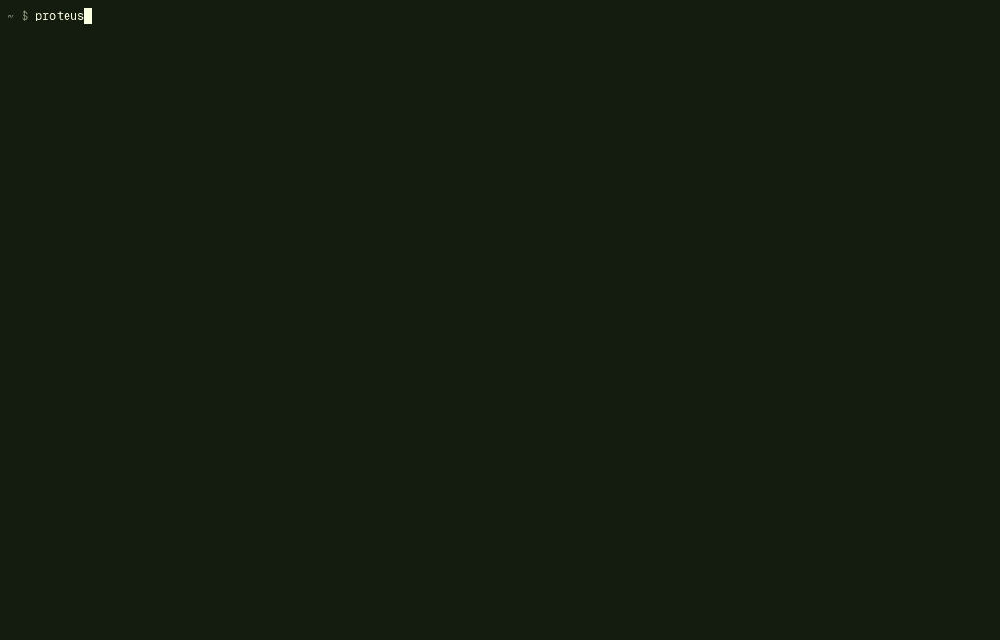

```bash
proteus view <job> --interactive --dashboard        # or a .pdb / .cif / .cif.gz path
proteus view structure.pdb --backend sixel          # a still, for a CI log
proteus view mutant.pdb --compare wildtype.pdb      # superposed; Kabsch RMSD over shared residues
```

A software rasteriser, a cartoon ribbon and a telemetry dashboard, in the terminal. No X11
forwarding, no WebGL, no headless display server — which is the situation you are in on a
cluster login node.

The ribbon is built from cubic Hermite splines through the Cα trace, with its wide face oriented
by the backbone carbonyl and flip-corrected (Carson & Bugg 1986), so β-strands lie flat in their
sheet and show the sheet's real twist. Parallel-transport frames are the fallback for Cα-only
traces. Elliptic cross-sections, Richardson β-arrowheads, SSAO, cel-outlines, disulfide sticks.

Two things separate it from the other terminal viewers:

- **It always computes secondary structure, and ignores the file's.** Strip the
  `HELIX`/`SHEET` records from a file and the picture does not change, because the assignment
  comes from eight-state Kabsch–Sander DSSP on the coordinates (the same `proteus-dssp` that is
  validated against mdtraj). ESMFold's PDB output carries no such records, and annotations
  that are present need not match the coordinates. ProteinView and StrucTTY infer
  secondary structure when a file has none, and pixelfold always computes it; what is less
  common is using one validated eight-state assignment everywhere. Pinned by
  `secondary_structure_survives_a_file_that_does_not_declare_it`.
- **It says when the picture cannot show what you asked for.** At 3.4 Å per pixel, consecutive
  residues 3.8 Å apart cannot be separated, so `view` prints the resolution and points at a
  finer backend instead of letting an outline read as detail.

Backends: ANSI 24-bit half-block (1×2 px/cell), Braille (2×4 dots/cell), **DEC Sixel** (xterm,
mlterm, foot, contour, WezTerm, Windows Terminal) and the kitty graphics protocol. Sixel is
6–21× cheaper on the wire than Proteus's own uncompressed kitty output at the same
resolution, which is what you want over SSH,
and its encoder is round-tripped through libsixel's own decoder in CI rather than eyeballed.

Keys: arrows or `hjkl` orbit, `+`/`-` zoom, `Space` spin, `Tab` dashboard, `c` colour scheme,
`o` SSAO and outlines, `d` disulfides, `r` reset camera, `q` quit.

In a kitty-protocol terminal (kitty, WezTerm, Ghostty), run locally rather than over SSH or
inside tmux, the interactive viewer draws real pixels instead of half-block cells; `p`
switches between the two, and `--backend halfblock` keeps the cells. The resolution follows
the terminal's cell size and drops while frames are slow. Half-block output is drawn 3 × 3
supersampled, so ribbons thinner than a cell stop breaking up. A complex opens coloured by
interface, and a model that is confident everywhere opens on its secondary structure, because
in pLDDT colours it would be one flat blue; `c` cycles through the rest.

<p align="center">
  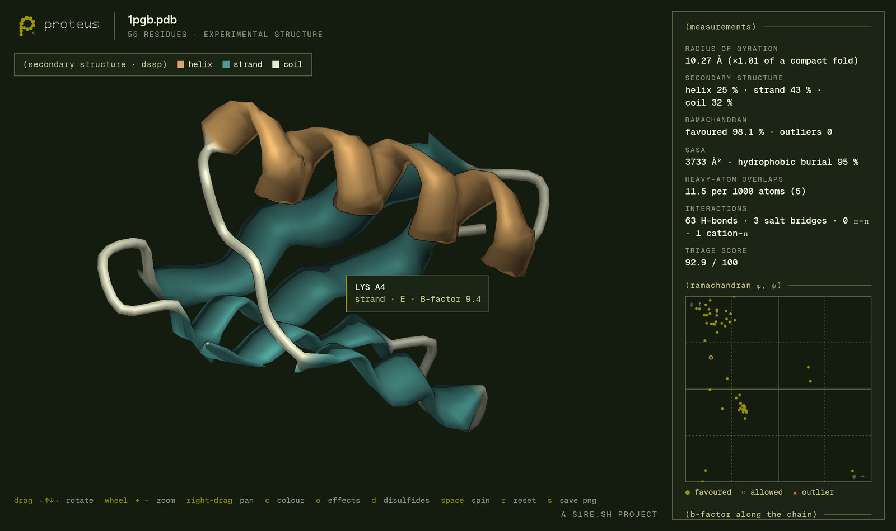
</p>
<p align="center"><sub>Protein G (1PGB) on the page <code>proteus view 1pgb.pdb --web</code> writes: the
same ribbon, DSSP and measurements as the terminal viewer, drawn with WebGL2 in one offline
HTML file.</sub></p>

When there is a browser at hand, `--web` opens the same structure in one: the ribbon mesh the
terminal draws, shaded by WebGL2 with SSAO and outlines, hover labels per residue, and the
measurements beside it. The page is a single HTML file with its fonts and geometry inside, so
it works offline and can be attached to a report.

<table>
  <tr>
    <td width="50%">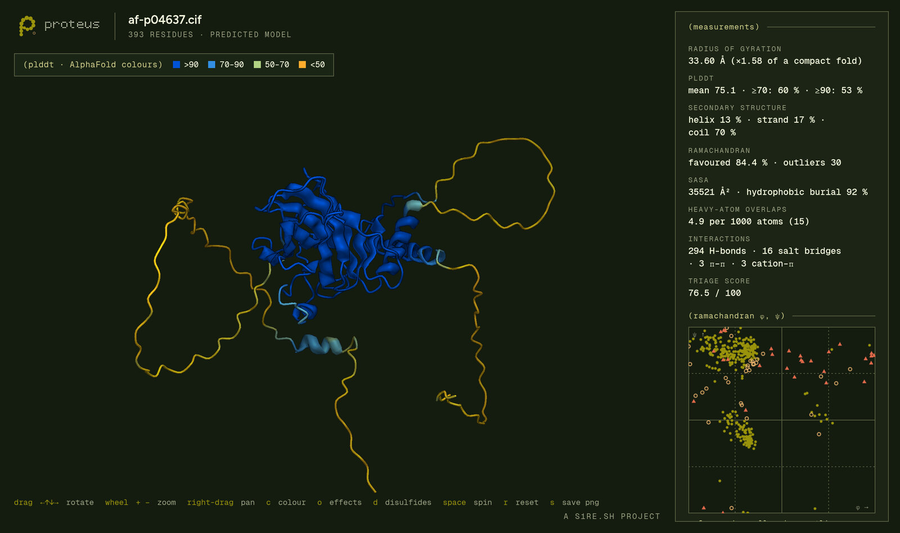</td>
    <td width="50%">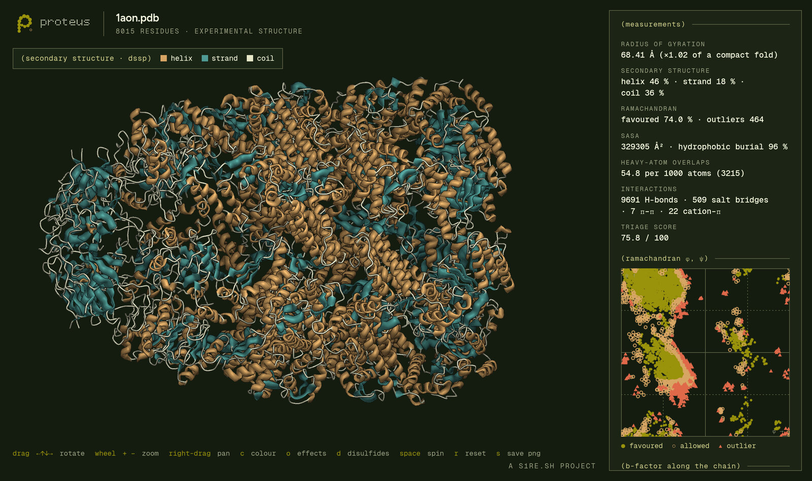</td>
  </tr>
  <tr>
    <td><sub>p53 from AlphaFold DB, coloured by pLDDT with AlphaFold's own bands.</sub></td>
    <td><sub>GroEL–GroES (1AON), 8 015 residues.</sub></td>
  </tr>
</table>

## 5. Make the models: mutate, fold, rank

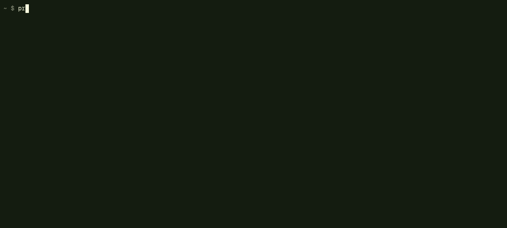

```bash
proteus mutate wt.fasta --mode alanine --start 24 --end 29 \
  | proteus screen - --runner esm-api --top 5 --export library.parquet
```

One pipe, no intermediate files. `mutate` writes a variant library (alanine scan or full
site-saturation); `screen -` reads it from stdin, folds each variant, runs the whole biophysics
stack on the result and ranks them.

The ranking is a triage filter, not a fitness predictor. It is checked on one thing only — that
a folded structure outranks a broken one (40/40 native-vs-decoy pairs, in `make validate`) — and
it is not validated against experimental stability or activity. For a sequence-level signal use
`--scorer esm2`, which ranks by ESM-2 likelihood instead, or `--scorer hybrid` for both.

Structures the offline simulator produced are tagged `engine = simulated` and kept out of the
leaderboard unless you pass `--runner simulated`. A tier that silently fell back tells you which
tier you asked for and why it could not honour it. Every export row carries the `engine` column;
the Parquet file is tagged `proteus.schema_version = 5` and reads directly into DuckDB, Polars
or PyArrow.

## 6. Drive it from a workflow engine

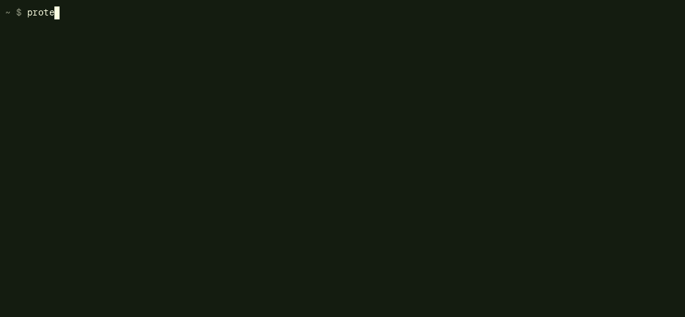

```bash
proteus serve --port 8080 --auth-token "$TOKEN" \
  --allow-image 'ghcr.io/otoyuki/*' --allow-dir "$PWD/work"
nextflow run examples/nextflow/screening.nf      # or: sprocket run … examples/wdl/analyze.wdl
```

`proteus serve` is a **GA4GH TES 1.1** server: a single binary talking to the host's
Podman or Docker socket. It passes the ELIXIR `openapi-test-runner` compliance suite, 23/23 test
cases and 187 assertions, run in CI against a real container executor rather than a mock.

Tasks run inside their own container image with `resources` enforced. `--auth-token`,
`--allow-image` and `--allow-dir` are the lockdown; `file://` input and output URLs may only
point inside an `--allow-dir` directory and everything else is rejected with 400. See
[SECURITY.md](SECURITY.md) for what is and is not covered.

Two workflow examples ship with the repo. The Sprocket (WDL) one runs in CI; the Nextflow one
(Nextflow 26 + nf-ga4gh 1.5) is exercised by hand and is what the recording above shows.
[`examples/wdl/README.md`](examples/wdl/README.md) describes what crosses the wire.
Swagger UI is at `/swagger-ui`, Prometheus metrics at `/metrics`.

---

## Where this sits next to other tools

Proteus is not the only Rust implementation of any one of its parts.

| if you want | use |
|---|---|
| a TES server for a **Kubernetes cluster** | [planetary](https://github.com/stjude-rust-labs/planetary) (St. Jude Rust Labs). Proteus is the single-binary-against-a-local-socket model, which is the other deployment shape, not a better one |
| a single-binary TES on Docker with **S3 staging and a web UI** | [poiesisd](https://github.com/JaeAeich/poiesisd), the same deployment shape as `proteus serve`; its author describes it as development-focused |
| structure parsing, BinaryCIF, density maps, **Python/C bindings** | [molex](https://github.com/foldit-org/molex) |
| batch structure features with **interface metrics** (buried area, shape complementarity) and protein–ligand features, into Parquet | [structscope](https://github.com/Danialgharaie/structscope) (work in progress by its own account) |
| ESM **embeddings** across CUDA and MLX backends | [esm-rs](https://github.com/tcztzy/esm-rs). Proteus's ESM work is variant-effect scoring, not representation |
| ESM-2, ESM C and ESM3 on candle as a library | [ferritin](https://github.com/ferritin-bio/ferritin) (`ferritin-plms`) |
| structure prediction and design **inside the binary** (ESMFold, ProteinMPNN, RFdiffusion2 on CPU) | [folding-everywhere](https://github.com/lingxusb/folding-everywhere). Proteus dispatches prediction to containers and APIs instead |
| a terminal viewer with iTerm2 support and more polish | [ProteinView](https://github.com/001TMF/ProteinView) |
| interactive analysis in a browser | [Mol\*](https://molstar.org), which Proteus does not try to replace |
| to **design** binders (hallucination, filters, relaxation) | [BindCraft](https://github.com/martinpacesa/BindCraft), or [FreeBindCraft](https://github.com/cytokineking/FreeBindCraft) without PyRosetta. Proteus scores what they, or RFdiffusion and BoltzGen pipelines, produce |
| the reference ipSAE implementation, pDockQ and per-residue output | [`ipsae.py`](https://github.com/DunbrackLab/IPSAE) (Dunbrack lab), which Proteus follows |
| Rosetta interface energies (ΔG, packstat, buried unsatisfied H-bonds) | PyRosetta's InterfaceAnalyzer |
| a full validation report with the all-atom **clashscore** (Reduce hydrogens + Probe) | [MolProbity](https://molprobity.biochem.duke.edu) or `phenix.molprobity`. Proteus reproduces MolProbity's covalent-geometry, Cβ, ω and rotamer checks, not its all-atom contacts |

**What this is not.** Not a folding engine — it orchestrates ESMFold and Boltz rather than
predicting structure itself, and no prediction image is published (build or pull one and point
`PROTEUS_IMAGE_FAST` / `PROTEUS_IMAGE_SOTA` at it). Not a replacement for Mol\*, PyMOL or
ChimeraX for interactive analysis. The terminal viewer is not unusual any more: ProteinView,
[StrucTTY](https://github.com/steineggerlab/StrucTTY) and
[pixelfold](https://github.com/fuyu-myk/pixelfold) all render structures in a terminal.

What Proteus adds is narrower than any of those. It puts the measurements a design campaign
filters on into one binary with no Python and no Rosetta. It checks each of them against the
implementation that defines it, and it measures the interface ranking against lab results.

## Speed

Same metric, same file, median wall-clock. Full table in [`bench/README.md`](bench/README.md).

| | vs |
|---|---|
| SASA | 2.3–4.7× mdtraj's C++ kernel (960 points each), ~33× Biopython (96 vs 100 points) |
| DSSP | 1.3–12× mdtraj |
| φ/ψ + Ramachandran | 33–159× mdtraj's φ/ψ API |
| covalent geometry + rotamers | 1AON (58 674 atoms): 0.07 s, against 31.5 s for the same cctbx checks run once on the same laptop (not in the bench harness) |

6VXX (22 812 atoms), full profile: 0.69 s. Crambin: ~9 ms.

## Install

```bash
# release binaries (Linux x86_64/aarch64, macOS x86_64/arm64)
curl -L https://github.com/OtoYuki/proteus/releases/latest/download/proteus-x86_64-unknown-linux-gnu.tar.gz | tar xz

# from source (Rust 1.94+); the binary is not on crates.io — that name is an unrelated project
cargo install --git https://github.com/OtoYuki/proteus proteus-cli

# container: the CLI works as is; `serve` needs the host's container socket for TES executors
podman run --rm -v "$PWD:/w" ghcr.io/otoyuki/proteus analyze --pdb /w/structure.pdb
podman run --rm -p 8080:8080 -v /run/user/$(id -u)/podman/podman.sock:/var/run/docker.sock \
  -v proteus-data:/data ghcr.io/otoyuki/proteus serve --host 0.0.0.0 --allow-dir /data
```

---

## The crates

A Cargo workspace of eight. Two of them depend on nothing else here and are meant to be used on
their own; the other six are the application, and ship as the `proteus` binary.

```
crates/
├── proteus-dssp/       Kabsch–Sander DSSP, 8-state. No dependencies by default.
├── proteus-esm/        ESM-2 masked-LM inference on candle. Standalone.
├── proteus-core/       Domain models, FASTA, DMS mutagenesis, all-atom biophysics
├── proteus-storage/    SQLite (SQLx WAL), BLAKE3 CAS, Parquet/CSV/JSON export
├── proteus-engine/     Async scheduler, prediction runners, TES task execution (bollard)
├── proteus-render/     Software 3D rasteriser, ribbon extruder, TUI dashboard
├── proteus-server/     Axum daemon: GA4GH TES 1.1, native API, SSE, OpenAPI
└── proteus-cli/        The binary: mutate, screen, analyze, view, esm, submit, serve
```

The application crates are not published to crates.io, because `proteus-engine` and
`proteus-cli` are taken there by unrelated projects. Install the binary from the releases, the
ghcr image, or `cargo install --git`.

## What the biophysics actually computes

All-atom, pure Rust, O(N) through spatial cell lists.

- **Hydrogen bonds** — heavy-atom geometry (donor–acceptor distance and antecedent angles; no
  hydrogens needed), backbone and sidechain, compared against mdtraj's Baker–Hubbard on
  structures that do carry hydrogens.
- **Salt bridges** — ≤ 4.0 Å between basic cations and acidic anions.
- **π–π stacking** — parallel-displaced and T-shaped edge-to-face, with a 2.0 Å lateral ring
  offset test (PLIP's criterion: benzene radius + 0.5 Å).
- **Cation–π** — ≤ 6.0 Å with the cation within 45° of the ring normal.
- **SASA** — Shrake–Rupley, 960-point Fibonacci sphere per atom, Bondi radii (mdtraj's default).
- **Ramachandran** — the six Top8000 percentile contour grids (general, Gly, cis-Pro, trans-Pro,
  pre-Pro, Ile/Val) converted from cctbx, with MolProbity's Favored ≥ 2 % and
  Allowed ≥ 0.05–0.2 % thresholds.
- **Secondary structure** — `proteus-dssp`, eight states from backbone H-bond energies
  (α/3₁₀/π helices, bridges, ladders, bends, turns), plus a three-state reduction.
- **Steric overlap** — severe heavy-atom overlaps (> 0.40 Å) per 1000 atoms, Bondi vdW radii,
  with covalent exclusions for intra-residue bonding, peptide linkages, proline ring geometry
  and disulfides. This is **not** the MolProbity clashscore, which adds hydrogens with Reduce
  first. It under-counts on deposited structures and is meant as a relative screen for grossly
  overlapping predicted models.
- **Covalent geometry** — every bond length, bond angle, chiral volume and planar group of
  the 20 amino acids and selenomethionine against Phenix's default restraints: geostd monomers
  (Engh & Huber 1991), the Conformation-Dependent Library v1.2 for the backbone of every
  residue linked on both sides, Engh & Huber 1999 targets for cis-proline, peptide links,
  C-terminal carboxylates and disulfides. Symmetric side-chain atoms named against the IUPAC
  convention are swapped first, as Phenix does. Outliers beyond 4σ, RMSZ per restraint type.
  Heavy atoms only, so it works on predicted models.
- **Cβ deviation and ω** — MolProbity's cbetadev (≥ 0.25 Å) and omegalyze (cis within 30° of
  0°, twisted between 30° and 150°).
- **Rotamers** — the seventeen Top8000 χ-angle distributions, outlier below 0.3 %, allowed below
  2 %, with rotamer names, as MolProbity's rotalyze.
- **Superposition** — Kabsch, via SVD on the 3×3 covariance matrix (`nalgebra`).
- **Interfaces** (`--interface`):
  - contacts: heavy atoms within 4 Å;
  - dSASA: the two sides' SASA minus the complex's, same Shrake–Rupley settings;
  - shape complementarity: Lawrence & Colman's Sc over Connolly surfaces with a 1.7 Å probe,
    15 dots/Ų, a 1.5 Å peripheral band and w = 0.5 Å⁻², ported from sc-rs;
  - H-bonds and salt bridges whose two ends are on opposite sides;
  - from the PAE: ipAE, the mean inter-chain PAE over both directions; ipSAE and LIS as in
    `ipsae.py`.

## ESM-2, in pure Rust

`proteus-esm` re-implements `EsmForMaskedLM` on
[candle](https://github.com/huggingface/candle). No Python, no PyTorch, one static binary. It
loads `facebook/esm2_t6_8M` through `esm2_t33_650M` from the Hub (the 3B and 15B repositories
publish only sharded PyTorch files; convert them to safetensors and load from disk) and
produces zero-shot mutation scores — wild-type or
masked marginals, following Meier et al. 2021 — and full deep mutational scans.

```bash
proteus esm score wildtype.fasta --mutations P19A,C4S --esm-masked
proteus esm scan wildtype.fasta --export scan.csv     # 20×L matrix + a terminal heat map
proteus mutate wt.fasta --mode saturation | proteus screen - --scorer hybrid --export lib.parquet
```

- **Parity**: logits within 2e-4 and amino-acid log-probabilities within 1e-4 of
  `transformers.EsmForMaskedLM` (fp32; largest observed 4.6e-5 / 3.3e-5), on three short
  proteins and one of 1022 residues × two checkpoints, against committed reference values; CI
  runs the 8M checkpoint on every push, the 35M one is run by hand. Up to 0.6.0 the rotary
  frequencies were recomputed rather than read from the checkpoint, an error of up to 0.1 in
  log-probability at full length that the short proteins alone had passed off as fp32 noise.
- **Input**: at most 1022 residues (the ESM-2 training length); whitespace and a final `*` are
  ignored; anything but amino-acid letters is an error, and substitutions must be between the
  20 standard amino acids. `[mutation=A10G:C4S]` (ProteinGym's separator) works in library
  headers.
- **Accuracy on real data**: ProteinGym v1.1 Spearman ρ over the five smallest single-mutant
  assays — mean |ρ| 0.42 with `esm2_t12_35M`, 0.24 with `esm2_t6_8M`
  ([`bench/README.md`](bench/README.md)).
- **Where it is weaker**, from ProteinGym's own per-taxon table rather than our five assays:
  ESM-2 650M averages Spearman ρ 0.457 on human assays and 0.261 on viral ones (0.414 over all
  217). Treat scores for viral proteins with particular caution. Past 400 residues
  `proteus esm` suggests scoring known domains separately.
- ESM-2 because it was the openly licensed family when this was written. ESM C and the open
  ESM3 weights have since been released under MIT (mid-2026); they are different architectures
  and not implemented here.

---

## Command reference

Jobs are referred to by UUID or by any unique prefix of one, the way git handles commits. The
leaderboard prints the first eight characters; `proteus view 0916a5e6` resolves it.

### `proteus` — the home screen

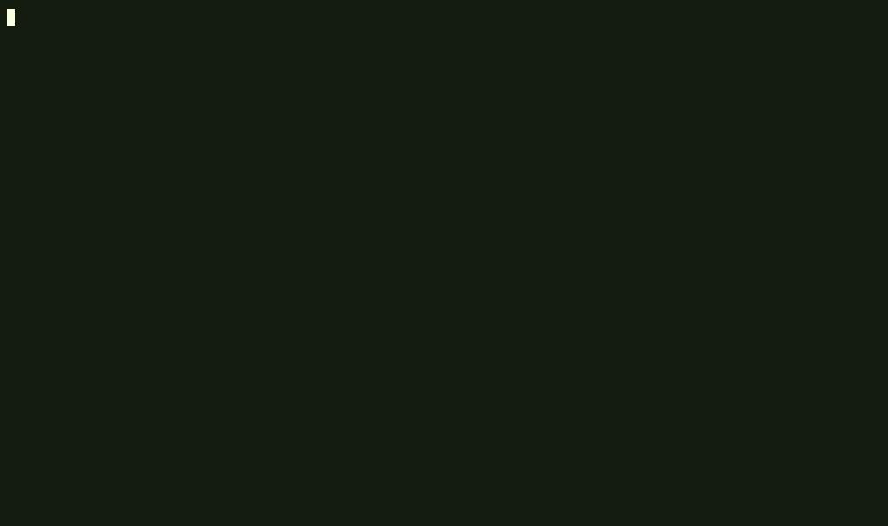

Run with no command in a terminal, `proteus` opens a full-screen home:

- **Jobs:** your jobs, refreshed every 2 s. Enter opens the 3-D viewer, `w` the browser
  page, `i` the full report, `/` filters the list, `s` sorts it (newest, name, state, pLDDT),
  `n` renames a job and `x` deletes one after asking. On a wide terminal the selected
  job sits beside the list with a still of its model, its measurements and, for a complex, the
  interface verdict. A failed job shows why it failed.
- **Structures:** a file browser over the current folder. Each structure file you stop on is
  measured in the background, with the same numbers as `analyze`, and previewed.
- **Run:** forms to fold a sequence (`submit`) or scan a protein (`mutate … | screen -`).

`1` `2` `3` switch tabs, also from a Run form's text field (Alt+digit while typing; on a
residue-number field digits are the number). Every action runs a `proteus` command, and the
Run forms show the exact command line before you
run it, so what you did can be pasted into a script. In a pipe or a script, bare `proteus` still
prints the usage and exits 2.

### `proteus mutate` — variant libraries

```bash
proteus mutate scaffold.fasta --mode alanine --output library.fasta
proteus mutate scaffold.fasta --mode saturation --start 10 --end 18 --max-variants 50
```

`alanine` substitutes alanine across a window; `saturation` substitutes all 20 canonical amino
acids. Write to a file with `--output`, or leave it out and pipe into `screen -`.

### `proteus screen` — the funnel

```bash
proteus screen library.fasta --tier fast --workers 8 --min-plddt 75 --top 10 \
  --export results.parquet
proteus mutate wt.fasta --mode alanine | proteus screen - --export results.parquet
```

`--runner` picks where folding happens: `oci` (a local container image), `esm-api` (the Meta
ESMFold API), `simulated` (an offline placeholder helix), or `auto`, which tries them in that
order. `--export` takes `.parquet`, `.csv` or `.json`; anything else is refused rather than
guessed at.

The `sota` tier runs Boltz-2 from an image you build once (16 GB, weights included):

```bash
podman build -t ghcr.io/jwohlwend/boltz:latest containers/boltz
systemctl --user enable --now podman.socket
proteus submit -f ubiquitin.fasta --tier sota --runner oci
```

Complexes, ligands, alignments and several samples go through the same tier:

```bash
# chains and ligands in Boltz's own header syntax (plain `>name` records are protein chains)
printf '>A|protein|empty\nPQITLWQRPL…\n>B|protein|empty\nPQITLWQRPL…\n>L|ccd\nMK1\n' > hivpr_mk1.fasta
proteus submit -f hivpr_mk1.fasta --tier sota --runner oci --samples 3
proteus submit -f target.fasta --tier sota --runner oci --msa server   # sends the sequence to ColabFold's server
proteus submit -f target.fasta --tier sota --runner oci --msa my.a3m   # your own alignment
proteus view <job> --model 2                                            # any of the samples
```

`--msa` is off by default: without it nothing leaves the machine and Boltz folds from the single
sequence, which is fine for well-studied folds and weaker for orphan proteins. `--msa server`
uses the public ColabFold MMseqs2 server. Samples run one at a time and the alignment is capped
at 1 024 sequences (`PROTEUS_BOLTZ_PARALLEL_SAMPLES`, `PROTEUS_BOLTZ_MAX_MSA_SEQS`), which is what
fits a 6 GB GPU. On an RTX 3060 Laptop the HIV-1 protease dimer with indinavir (243 tokens, MSA
from the server, 3 samples) takes 86 s end to end: pTM 0.984, ipTM 0.982, 0.24 Å Cα RMSD from the
1HSG crystal structure and 0.39–0.82 Å for the indinavir pose. 1HSG is from 1995 and certainly in
Boltz's training data, so this shows the pipeline works, not how Boltz does on a new complex.

Tier containers get the GPU through CDI (`nvidia.com/gpu=all`) whenever the NVIDIA Container
Toolkit's spec is installed (`/etc/cdi/nvidia.yaml`, from `nvidia-ctk cdi generate`).
`PROTEUS_GPU=off` keeps them on the CPU; any other value is used as the CDI device name. On an
RTX 3060 Laptop (6 GB) human ubiquitin folds in 50 s end to end at 3.7 GB of GPU memory,
0.80 Å Cα RMSD from the 1UBQ crystal structure.

### `proteus view` — the viewer

```bash
proteus view structure.pdb --interactive --dashboard
proteus view structure.pdb --backend halfblock --color ss --width 80 --height 36
proteus view structure.pdb --backend sixel        # or braille, or kitty
proteus view mutant.pdb --compare wildtype.pdb --interactive
proteus view structure.pdb --html out.html        # our own self-contained WebGL2 page, works offline
scripts/gallery.sh                                 # a gallery of such pages (target/gallery/)
```

`--compare` pairs residues by chain ID and number, by number alone for two single-chain files,
or by sequence alignment, whichever matches most; it superposes only the paired residues and
reports how many that was. The RMSD is marked `✓` when the two are the same sequence residue for
residue, and `!` with a warning otherwise, since the number then describes only the paired part.
`--web` and `--html` draw one structure and refuse `--compare`.

```bash
proteus view <job> --web                                       # PAE and pTM found beside the model
proteus view AF-P69905-F1-model_v6.pdb --pae pae.json --web    # or named explicitly
proteus view model.pdb --color-by scan.csv --web               # an `esm scan --export` matrix
proteus view model.pdb --color-by AF-P69905-F1-aa-substitutions.csv:am_pathogenicity --web
proteus view model.pdb --compare reference.pdb --web           # coloured by how far each residue moved
```

The browser page points at what it measures:

- **Confidence.** pTM (and ipTM for a complex) and the PAE map, in AlphaFold DB's colours, read
  from Boltz's `pae_*.npz`/`confidence_*.json`, AlphaFold DB's `*-predicted_aligned_error_v*.json`,
  ColabFold's `*_scores_*.json` or AlphaFold 3's `*_full_data_*.json`, found beside the model by
  name or given with `--pae`. Hover reads a cell; drag a box to select two ranges and get the
  mean error between them. The terminal dashboard shows pTM and a half-block PAE map.
- **Selection.** Click the structure, the sequence track, a Ramachandran point, the pLDDT strip
  or the PAE map. The rest of the ribbon dims, the selection and everything within 5 Å are drawn
  as sticks, and a box gives Cα–Cα and closest-atom distances, PAE both ways, the residues
  within 5 Å and a PyMOL selection. `n` toggles the neighbourhood, `f` focuses, `Esc` clears.
- **Findings.** Ramachandran outliers, heavy-atom overlaps, hydrogen bonds, salt bridges and
  π interactions are listed; each one selects its residues and draws a dashed line between the
  atoms, and "draw all" shows a whole kind at once.
- **Ligands.** Non-water HETATM groups are drawn as sticks; selecting one shows its binding
  site.
- **Scores.** `--color-by FILE[:COLUMN]` colours residues by a mutational scan or a variant
  effect table (one row per `L43A`, as AlphaMissense and `proteus screen` exports write) or
  per-residue values, in both viewers, with a residue × amino-acid map in the browser. Red is
  the damaging end: low for fitness and ESM scores, high for columns named like pathogenicity or
  ΔΔG (`--higher-is-worse`/`--lower-is-worse` override). Positions are matched by residue
  number or sequence index, whichever the table's wild-type letters agree with; a table for
  another sequence is refused.
- **Comparison.** `--compare` in the browser keeps the model where it is, draws the reference
  (`x` hides it) and colours each residue by its Cα deviation.
- **Files.** The page carries the model and hands it back, with its PAE as AlphaFold DB JSON.
- **Complexes.** Per-chain pTM and an ipTM grid; a ligand's per-atom PAE tokens are averaged into
  one row, so the map covers residues and ligands. A prediction with several samples lists them
  with their scores and their Cα and ligand RMSD to the one shown.
- **Measuring and labels.** `m` measures: two atoms give a distance, three an angle, four a
  dihedral. `l` pins labels on the selection.
- **Surfaces.** `u` cycles a molecular surface (a Gaussian density, Grant & Pickup 1995)
  coloured like the ribbon, by Kyte–Doolittle hydrophobicity, or by Coulombic potential from
  formal charges with ε = 4r, as ChimeraX's `coulombic` defaults to. It is an estimate, not a
  Poisson–Boltzmann calculation.
- **Sessions.** The view (camera, colours, selection, measurements, labels, surface) is kept in
  the page's URL, so a bookmark or a copied link opens it the same way.

In the terminal, `[` and `]` step through the same findings, dimming the rest and centring each
one; `0` clears.

### `proteus analyze` — one structure in full, or a table over many

```bash
proteus analyze structure.pdb                          # the full report, below
proteus analyze models/ --export qc.parquet            # one row per file: .parquet, .csv, .json
proteus analyze a.pdb b.cif.gz --json                  # JSON Lines on stdout
proteus analyze models/ --reference wt.pdb -j 8 --top 50
proteus analyze boltz_results/ --interface A:B --export triage.parquet   # binder–target interface
```

Directories are searched recursively for `.pdb`, `.ent`, `.cif` and `.mmcif`, each optionally
gzipped. `--confidence-source predicted|experimental` overrides the pLDDT-vs-B-factor detection.
The Parquet file is tagged `proteus.qc_schema_version = 3`. Version 2 added the eleven
covalent-geometry columns, and 3 added the thirteen interface columns, which are empty without
`--interface`.

`--interface BINDER[:TARGET]` measures a binder–target interface (section 1). Without a value it
takes the first chain against the rest. The PAE and scores files are found beside each model:

- Boltz: `pae_<model>.npz` and `confidence_<model>.json`.
- ColabFold: `<name>_scores_rank_….json`.
- AlphaFold 3 run locally: `<name>_confidences.json` and `<name>_summary_confidences.json`
  beside `<name>_model.cif`, or `confidences.json` beside a sample's `model.cif`.
- AlphaFold Server: `<name>_full_data_<k>.json`.
- Protenix: `<job>_full_data_sample_<k>.json` (written with `--need_atom_confidence`) and
  `<job>_summary_confidence_sample_<k>.json` beside `<job>_sample_<k>.cif`.
- OpenFold3: `…_confidences.json` or `.npz` and `…_confidences_aggregated.json` beside
  `…_model.cif`.
- Chai-1: `scores.model_idx_<k>.npz` (pTM, ipTM) beside `pred.model_idx_<k>.cif`. Chai-1's
  command line writes no PAE; a `pae.model_idx_<k>.npy` saved from its Python API is read. This
  is checked against Chai-1's source, not on its output: it needs more than a 6 GB GPU.

AlphaFold 3-style predictors write one PAE row per token: one per standard residue, one per
heavy atom of a ligand, and for a modified residue one per atom (AlphaFold 3, Boltz-1,
Protenix, OpenFold3) or one (Boltz-2). The protein residues' rows are picked out under whichever
convention accounts for every row, so complexes with ligands and modified residues are scored.
Real Boltz-2, Protenix and OpenFold3 output of such a complex is checked in the tests. When a
matrix fits the model under neither, the PAE columns stay empty and `analyze` says why.

1CRN (crambin). It is an X-ray structure, so no pLDDT is reported — the B-factor column is not
a confidence and Proteus will not pretend it is. The ten worst covalent-geometry outliers follow
the table (`--json` carries up to 100):

```
┌──────────────────────────────────────────┬───────────────────────────────────────────────────────────────────┐
│ Biophysical Metric                       ┆ Value                                                             │
╞══════════════════════════════════════════╪═══════════════════════════════════════════════════════════════════╡
│ Radius of Gyration (Rg)                  ┆ 9.676 Å                                                           │
├╌╌╌╌╌╌╌╌╌╌╌╌╌╌╌╌╌╌╌╌╌╌╌╌╌╌╌╌╌╌╌╌╌╌╌╌╌╌╌╌╌╌┼╌╌╌╌╌╌╌╌╌╌╌╌╌╌╌╌╌╌╌╌╌╌╌╌╌╌╌╌╌╌╌╌╌╌╌╌╌╌╌╌╌╌╌╌╌╌╌╌╌╌╌╌╌╌╌╌╌╌╌╌╌╌╌╌╌╌╌┤
│ Contact Density (C-alpha <= 8Å)          ┆ 9.86%                                                             │
├╌╌╌╌╌╌╌╌╌╌╌╌╌╌╌╌╌╌╌╌╌╌╌╌╌╌╌╌╌╌╌╌╌╌╌╌╌╌╌╌╌╌┼╌╌╌╌╌╌╌╌╌╌╌╌╌╌╌╌╌╌╌╌╌╌╌╌╌╌╌╌╌╌╌╌╌╌╌╌╌╌╌╌╌╌╌╌╌╌╌╌╌╌╌╌╌╌╌╌╌╌╌╌╌╌╌╌╌╌╌┤
│ pLDDT                                    ┆ n/a (experimental structure; B-factor column is not a confidence) │
├╌╌╌╌╌╌╌╌╌╌╌╌╌╌╌╌╌╌╌╌╌╌╌╌╌╌╌╌╌╌╌╌╌╌╌╌╌╌╌╌╌╌┼╌╌╌╌╌╌╌╌╌╌╌╌╌╌╌╌╌╌╌╌╌╌╌╌╌╌╌╌╌╌╌╌╌╌╌╌╌╌╌╌╌╌╌╌╌╌╌╌╌╌╌╌╌╌╌╌╌╌╌╌╌╌╌╌╌╌╌┤
│ Secondary Structure Composition          ┆ α-Helix: 47.8% | β-Strand: 8.7% | Coil: 43.5%                     │
├╌╌╌╌╌╌╌╌╌╌╌╌╌╌╌╌╌╌╌╌╌╌╌╌╌╌╌╌╌╌╌╌╌╌╌╌╌╌╌╌╌╌┼╌╌╌╌╌╌╌╌╌╌╌╌╌╌╌╌╌╌╌╌╌╌╌╌╌╌╌╌╌╌╌╌╌╌╌╌╌╌╌╌╌╌╌╌╌╌╌╌╌╌╌╌╌╌╌╌╌╌╌╌╌╌╌╌╌╌╌┤
│ Ramachandran Conformation                ┆ Favored: 97.7% | Allowed: 2.3% | Outliers: 0                      │
├╌╌╌╌╌╌╌╌╌╌╌╌╌╌╌╌╌╌╌╌╌╌╌╌╌╌╌╌╌╌╌╌╌╌╌╌╌╌╌╌╌╌┼╌╌╌╌╌╌╌╌╌╌╌╌╌╌╌╌╌╌╌╌╌╌╌╌╌╌╌╌╌╌╌╌╌╌╌╌╌╌╌╌╌╌╌╌╌╌╌╌╌╌╌╌╌╌╌╌╌╌╌╌╌╌╌╌╌╌╌┤
│ Solvent Accessible Surface Area          ┆ Total: 2973.4 Ų (Hydrophobic Burial: 92.8%)                      │
├╌╌╌╌╌╌╌╌╌╌╌╌╌╌╌╌╌╌╌╌╌╌╌╌╌╌╌╌╌╌╌╌╌╌╌╌╌╌╌╌╌╌┼╌╌╌╌╌╌╌╌╌╌╌╌╌╌╌╌╌╌╌╌╌╌╌╌╌╌╌╌╌╌╌╌╌╌╌╌╌╌╌╌╌╌╌╌╌╌╌╌╌╌╌╌╌╌╌╌╌╌╌╌╌╌╌╌╌╌╌┤
│ Heavy-atom steric overlap (>0.4 Å, no H) ┆ 0.0 per 1k atoms (0 overlaps)                                     │
├╌╌╌╌╌╌╌╌╌╌╌╌╌╌╌╌╌╌╌╌╌╌╌╌╌╌╌╌╌╌╌╌╌╌╌╌╌╌╌╌╌╌┼╌╌╌╌╌╌╌╌╌╌╌╌╌╌╌╌╌╌╌╌╌╌╌╌╌╌╌╌╌╌╌╌╌╌╌╌╌╌╌╌╌╌╌╌╌╌╌╌╌╌╌╌╌╌╌╌╌╌╌╌╌╌╌╌╌╌╌┤
│ Bond lengths (geostd + CDL)              ┆ RMSZ 1.50 | 2 of 337 beyond 4σ                                    │
├╌╌╌╌╌╌╌╌╌╌╌╌╌╌╌╌╌╌╌╌╌╌╌╌╌╌╌╌╌╌╌╌╌╌╌╌╌╌╌╌╌╌┼╌╌╌╌╌╌╌╌╌╌╌╌╌╌╌╌╌╌╌╌╌╌╌╌╌╌╌╌╌╌╌╌╌╌╌╌╌╌╌╌╌╌╌╌╌╌╌╌╌╌╌╌╌╌╌╌╌╌╌╌╌╌╌╌╌╌╌┤
│ Bond angles (geostd + CDL)               ┆ RMSZ 1.55 | 10 of 466 beyond 4σ                                   │
├╌╌╌╌╌╌╌╌╌╌╌╌╌╌╌╌╌╌╌╌╌╌╌╌╌╌╌╌╌╌╌╌╌╌╌╌╌╌╌╌╌╌┼╌╌╌╌╌╌╌╌╌╌╌╌╌╌╌╌╌╌╌╌╌╌╌╌╌╌╌╌╌╌╌╌╌╌╌╌╌╌╌╌╌╌╌╌╌╌╌╌╌╌╌╌╌╌╌╌╌╌╌╌╌╌╌╌╌╌╌┤
│ Chirality | planarity                    ┆ 0 chiral outliers (0 inverted) | 0 planar groups beyond 4σ        │
├╌╌╌╌╌╌╌╌╌╌╌╌╌╌╌╌╌╌╌╌╌╌╌╌╌╌╌╌╌╌╌╌╌╌╌╌╌╌╌╌╌╌┼╌╌╌╌╌╌╌╌╌╌╌╌╌╌╌╌╌╌╌╌╌╌╌╌╌╌╌╌╌╌╌╌╌╌╌╌╌╌╌╌╌╌╌╌╌╌╌╌╌╌╌╌╌╌╌╌╌╌╌╌╌╌╌╌╌╌╌┤
│ Cβ deviation (≥0.25 Å)                   ┆ 0 of 42 residues                                                  │
├╌╌╌╌╌╌╌╌╌╌╌╌╌╌╌╌╌╌╌╌╌╌╌╌╌╌╌╌╌╌╌╌╌╌╌╌╌╌╌╌╌╌┼╌╌╌╌╌╌╌╌╌╌╌╌╌╌╌╌╌╌╌╌╌╌╌╌╌╌╌╌╌╌╌╌╌╌╌╌╌╌╌╌╌╌╌╌╌╌╌╌╌╌╌╌╌╌╌╌╌╌╌╌╌╌╌╌╌╌╌┤
│ Peptide ω                                ┆ 0 cis-Pro | 0 cis non-Pro | 0 twisted (of 45)                     │
├╌╌╌╌╌╌╌╌╌╌╌╌╌╌╌╌╌╌╌╌╌╌╌╌╌╌╌╌╌╌╌╌╌╌╌╌╌╌╌╌╌╌┼╌╌╌╌╌╌╌╌╌╌╌╌╌╌╌╌╌╌╌╌╌╌╌╌╌╌╌╌╌╌╌╌╌╌╌╌╌╌╌╌╌╌╌╌╌╌╌╌╌╌╌╌╌╌╌╌╌╌╌╌╌╌╌╌╌╌╌┤
│ Rotamers (Top8000)                       ┆ outliers 0.0% (0 of 37) | allowed 1                               │
├╌╌╌╌╌╌╌╌╌╌╌╌╌╌╌╌╌╌╌╌╌╌╌╌╌╌╌╌╌╌╌╌╌╌╌╌╌╌╌╌╌╌┼╌╌╌╌╌╌╌╌╌╌╌╌╌╌╌╌╌╌╌╌╌╌╌╌╌╌╌╌╌╌╌╌╌╌╌╌╌╌╌╌╌╌╌╌╌╌╌╌╌╌╌╌╌╌╌╌╌╌╌╌╌╌╌╌╌╌╌┤
│ Hydrogen Bonds (H-Bonds)                 ┆ 53 total (42 BB-BB, 10 BB-SC, 1 SC-SC)                            │
├╌╌╌╌╌╌╌╌╌╌╌╌╌╌╌╌╌╌╌╌╌╌╌╌╌╌╌╌╌╌╌╌╌╌╌╌╌╌╌╌╌╌┼╌╌╌╌╌╌╌╌╌╌╌╌╌╌╌╌╌╌╌╌╌╌╌╌╌╌╌╌╌╌╌╌╌╌╌╌╌╌╌╌╌╌╌╌╌╌╌╌╌╌╌╌╌╌╌╌╌╌╌╌╌╌╌╌╌╌╌┤
│ Ionic Salt Bridges (≤4.0Å)               ┆ 1 detected (closest: ARG17:NH2-GLU23:OE2 3.97Å)                   │
├╌╌╌╌╌╌╌╌╌╌╌╌╌╌╌╌╌╌╌╌╌╌╌╌╌╌╌╌╌╌╌╌╌╌╌╌╌╌╌╌╌╌┼╌╌╌╌╌╌╌╌╌╌╌╌╌╌╌╌╌╌╌╌╌╌╌╌╌╌╌╌╌╌╌╌╌╌╌╌╌╌╌╌╌╌╌╌╌╌╌╌╌╌╌╌╌╌╌╌╌╌╌╌╌╌╌╌╌╌╌┤
│ Aromatic π-π Stacking                    ┆ 0 conjugated pairs (0 parallel, 0 T-shaped)                       │
├╌╌╌╌╌╌╌╌╌╌╌╌╌╌╌╌╌╌╌╌╌╌╌╌╌╌╌╌╌╌╌╌╌╌╌╌╌╌╌╌╌╌┼╌╌╌╌╌╌╌╌╌╌╌╌╌╌╌╌╌╌╌╌╌╌╌╌╌╌╌╌╌╌╌╌╌╌╌╌╌╌╌╌╌╌╌╌╌╌╌╌╌╌╌╌╌╌╌╌╌╌╌╌╌╌╌╌╌╌╌┤
│ Cation-π Interactions                    ┆ 0 active interactions                                             │
├╌╌╌╌╌╌╌╌╌╌╌╌╌╌╌╌╌╌╌╌╌╌╌╌╌╌╌╌╌╌╌╌╌╌╌╌╌╌╌╌╌╌┼╌╌╌╌╌╌╌╌╌╌╌╌╌╌╌╌╌╌╌╌╌╌╌╌╌╌╌╌╌╌╌╌╌╌╌╌╌╌╌╌╌╌╌╌╌╌╌╌╌╌╌╌╌╌╌╌╌╌╌╌╌╌╌╌╌╌╌┤
│ Non-Covalent Network Density             ┆ 117.4 contacts / 100 res                                          │
├╌╌╌╌╌╌╌╌╌╌╌╌╌╌╌╌╌╌╌╌╌╌╌╌╌╌╌╌╌╌╌╌╌╌╌╌╌╌╌╌╌╌┼╌╌╌╌╌╌╌╌╌╌╌╌╌╌╌╌╌╌╌╌╌╌╌╌╌╌╌╌╌╌╌╌╌╌╌╌╌╌╌╌╌╌╌╌╌╌╌╌╌╌╌╌╌╌╌╌╌╌╌╌╌╌╌╌╌╌╌┤
│ Candidate Fitness Score                  ┆ 98.2 / 100                                                        │
└──────────────────────────────────────────┴───────────────────────────────────────────────────────────────────┘
┌─────────────────────────┬───────────────────────────────────────────┬─────────┬─────────┬──────┐
│ Worst geometry outliers ┆ Atoms                                     ┆ Ideal   ┆ Model   ┆ Z    │
╞═════════════════════════╪═══════════════════════════════════════════╪═════════╪═════════╪══════╡
│ angle                   ┆ A 14 ASN OD1 – A 14 ASN CG – A 14 ASN ND2 ┆ 122.600 ┆ 128.625 ┆ -6.0 │
├╌╌╌╌╌╌╌╌╌╌╌╌╌╌╌╌╌╌╌╌╌╌╌╌╌┼╌╌╌╌╌╌╌╌╌╌╌╌╌╌╌╌╌╌╌╌╌╌╌╌╌╌╌╌╌╌╌╌╌╌╌╌╌╌╌╌╌╌╌┼╌╌╌╌╌╌╌╌╌┼╌╌╌╌╌╌╌╌╌┼╌╌╌╌╌╌┤
│ bond                    ┆ A 37 GLY N – A 37 GLY CA                  ┆ 1.447   ┆ 1.518   ┆ -5.8 │
├╌╌╌╌╌╌╌╌╌╌╌╌╌╌╌╌╌╌╌╌╌╌╌╌╌┼╌╌╌╌╌╌╌╌╌╌╌╌╌╌╌╌╌╌╌╌╌╌╌╌╌╌╌╌╌╌╌╌╌╌╌╌╌╌╌╌╌╌╌┼╌╌╌╌╌╌╌╌╌┼╌╌╌╌╌╌╌╌╌┼╌╌╌╌╌╌┤
│ angle                   ┆ A 7 ILE CA – A 7 ILE C – A 7 ILE O        ┆ 120.950 ┆ 115.385 ┆ +5.4 │
├╌╌╌╌╌╌╌╌╌╌╌╌╌╌╌╌╌╌╌╌╌╌╌╌╌┼╌╌╌╌╌╌╌╌╌╌╌╌╌╌╌╌╌╌╌╌╌╌╌╌╌╌╌╌╌╌╌╌╌╌╌╌╌╌╌╌╌╌╌┼╌╌╌╌╌╌╌╌╌┼╌╌╌╌╌╌╌╌╌┼╌╌╌╌╌╌┤
│ angle                   ┆ A 12 ASN OD1 – A 12 ASN CG – A 12 ASN ND2 ┆ 122.600 ┆ 127.608 ┆ -5.0 │
├╌╌╌╌╌╌╌╌╌╌╌╌╌╌╌╌╌╌╌╌╌╌╌╌╌┼╌╌╌╌╌╌╌╌╌╌╌╌╌╌╌╌╌╌╌╌╌╌╌╌╌╌╌╌╌╌╌╌╌╌╌╌╌╌╌╌╌╌╌┼╌╌╌╌╌╌╌╌╌┼╌╌╌╌╌╌╌╌╌┼╌╌╌╌╌╌┤
│ angle                   ┆ A 36 PRO C – A 37 GLY N – A 37 GLY CA     ┆ 122.550 ┆ 117.411 ┆ +4.7 │
├╌╌╌╌╌╌╌╌╌╌╌╌╌╌╌╌╌╌╌╌╌╌╌╌╌┼╌╌╌╌╌╌╌╌╌╌╌╌╌╌╌╌╌╌╌╌╌╌╌╌╌╌╌╌╌╌╌╌╌╌╌╌╌╌╌╌╌╌╌┼╌╌╌╌╌╌╌╌╌┼╌╌╌╌╌╌╌╌╌┼╌╌╌╌╌╌┤
│ angle                   ┆ A 21 THR O – A 21 THR C – A 22 PRO N      ┆ 121.270 ┆ 125.513 ┆ -4.4 │
├╌╌╌╌╌╌╌╌╌╌╌╌╌╌╌╌╌╌╌╌╌╌╌╌╌┼╌╌╌╌╌╌╌╌╌╌╌╌╌╌╌╌╌╌╌╌╌╌╌╌╌╌╌╌╌╌╌╌╌╌╌╌╌╌╌╌╌╌╌┼╌╌╌╌╌╌╌╌╌┼╌╌╌╌╌╌╌╌╌┼╌╌╌╌╌╌┤
│ angle                   ┆ A 1 THR CA – A 1 THR CB – A 1 THR OG1     ┆ 109.600 ┆ 103.060 ┆ +4.4 │
├╌╌╌╌╌╌╌╌╌╌╌╌╌╌╌╌╌╌╌╌╌╌╌╌╌┼╌╌╌╌╌╌╌╌╌╌╌╌╌╌╌╌╌╌╌╌╌╌╌╌╌╌╌╌╌╌╌╌╌╌╌╌╌╌╌╌╌╌╌┼╌╌╌╌╌╌╌╌╌┼╌╌╌╌╌╌╌╌╌┼╌╌╌╌╌╌┤
│ angle                   ┆ A 34 ILE O – A 34 ILE C – A 35 ILE N      ┆ 123.180 ┆ 127.746 ┆ -4.3 │
├╌╌╌╌╌╌╌╌╌╌╌╌╌╌╌╌╌╌╌╌╌╌╌╌╌┼╌╌╌╌╌╌╌╌╌╌╌╌╌╌╌╌╌╌╌╌╌╌╌╌╌╌╌╌╌╌╌╌╌╌╌╌╌╌╌╌╌╌╌┼╌╌╌╌╌╌╌╌╌┼╌╌╌╌╌╌╌╌╌┼╌╌╌╌╌╌┤
│ angle                   ┆ A 45 ALA N – A 45 ALA CA – A 45 ALA CB    ┆ 110.440 ┆ 103.984 ┆ +4.2 │
├╌╌╌╌╌╌╌╌╌╌╌╌╌╌╌╌╌╌╌╌╌╌╌╌╌┼╌╌╌╌╌╌╌╌╌╌╌╌╌╌╌╌╌╌╌╌╌╌╌╌╌╌╌╌╌╌╌╌╌╌╌╌╌╌╌╌╌╌╌┼╌╌╌╌╌╌╌╌╌┼╌╌╌╌╌╌╌╌╌┼╌╌╌╌╌╌┤
│ bond                    ┆ A 35 ILE N – A 35 ILE CA                  ┆ 1.461   ┆ 1.497   ┆ -4.2 │
└─────────────────────────┴───────────────────────────────────────────┴─────────┴─────────┴──────┘
2 more outliers not shown.
```

### `proteus submit`, `status`, `inspect`, `rename`, `delete` — jobs

```bash
proteus submit --file wt.fasta --runner esm-api    # prints the job id
proteus status 0916a5e6                            # state, tier, timings
proteus inspect 0916a5e6                           # the full biophysical report
proteus rename 0916a5e6 'PD-L1 binder 7'           # the name the lists show
proteus delete 0916a5e6                            # records and files (alias: rm)
```

A job id can be any unique prefix of it. `delete --keep-files` removes the records and leaves
the job's folder under the data directory.

### `proteus serve` — the daemon

```bash
proteus serve --port 8080 --host 0.0.0.0 --auth-token "$TOKEN" \
  --allow-image 'ghcr.io/otoyuki/*' --allow-dir /srv/tes-store
```

---

## Building and checking it yourself

```bash
cargo build --release                                  # target/release/proteus
cargo test --workspace                                 # unit, integration and doc tests
cargo clippy --workspace --all-targets -- -D warnings
cargo fmt --check
scripts/smoke.sh                                       # every command end to end, with assertions
scripts/smoke.sh --tes IMAGE                           # …and a real TES task in a container
make validate                                          # the 53-file corpus (needs uv; ~50 MB of structures, ~650 MB of Python reference tools, once)
bench/run.sh                                           # criterion + mdtraj/FreeSASA/Biopython
```

Needs Rust 1.94 or newer. A container runtime is optional: a rootless Podman socket
(`systemctl --user enable --now podman.socket`) or a Docker daemon, for the OCI runner and TES
executors.

---

## How the numbers are defined

### Radius of gyration

$$\mathbf{r}_{\text{cm}} = \frac{1}{N}\sum_{i=1}^N \mathbf{r}_i \quad\text{over all } C_\alpha\text{ atoms}$$

$$R_g = \sqrt{\frac{1}{N}\sum_{i=1}^N \|\mathbf{r}_i - \mathbf{r}_{\text{cm}}\|^2}$$

### Kabsch superposition (Cα RMSD)

For centred coordinate matrices $P, Q \in \mathbb{R}^{N \times 3}$:

1. Cross-covariance: $H = P^T Q$.
2. SVD: $H = U \Sigma V^T$.
3. Correct for reflection:
   $$R = V \begin{pmatrix} 1 & 0 & 0 \\ 0 & 1 & 0 \\ 0 & 0 & \det(V U^T) \end{pmatrix} U^T$$
4. $\text{RMSD} = \sqrt{\frac{1}{N}\sum_{i=1}^N \|R \mathbf{p}_i - \mathbf{q}_i\|^2}$

### Heavy-atom steric overlap

$$\text{Clash}_{1k} = \frac{\sum_{i < j} \mathbb{I}\left(r_i^{\text{vdW}} + r_j^{\text{vdW}} - d_{ij} > 0.40\text{ \AA}\right)}{N_{\text{atoms}}} \times 1000$$

Excluding atoms in the same residue, backbone peptide linkages and proline ring geometry
($|res_i - res_j| = 1$ in the same chain), disulfide-bonded sulfur pairs
($d(S_\gamma, S_\gamma) \in [1.70, 2.60]$ Å), and hydrogen-bond donor–acceptor pairs at
2.4 Å or more. The last one matters: with heavy-atom radii (N 1.55, O 1.52 Å) every ordinary
N–H···O hydrogen bond and salt bridge (2.5–3.1 Å) overlaps by more than 0.4 Å, and MolProbity only
avoids calling them clashes because it adds the hydrogens first. Before 0.9 Proteus counted them:
all 3 "overlaps" in a Boltz ubiquitin model and all 4 in AF-P69905 were hydrogen bonds or salt
bridges; with the exclusion they are 0, and 1HSG's 7 are 3.

### Covalent geometry

For each restraint with target $x_0$ and esd $\sigma$, $Z = (x_0 - x)/\sigma$; a restraint is
an outlier when $|Z| > 4$, and $\text{RMSZ} = \sqrt{\tfrac{1}{n}\sum Z^2}$ over all $n$
restraints of a type (≈ 1 for a well-refined structure). Chiral volume for a centre $c$ with
neighbours $a, b, d$: $V = (a - c)\cdot\big((b - c)\times(d - c)\big)$, $\sigma = 0.2$ ų; a centre
is counted as **inverted** only when $V$ lies on the other side of zero by at least half the
ideal magnitude. A planar group is scored by the largest distance of an atom from the
weighted least-squares plane, divided by that atom's esd. Cβ deviation is the distance from
the modelled CB to the mean of two ideal CB positions built from N, CA, C.

### Non-covalent interactions

- **Hydrogen bonds** (heavy-atom criteria):
  $$2.4\,\text{Å} \le d(D, A) \le 3.5\,\text{Å}, \quad \theta(D_{\text{ante}}-D\cdots A) \ge 90^\circ, \quad \theta(A_{\text{ante}}-A\cdots D) \ge 90^\circ$$
- **Salt bridges:**
  $$d(\text{cation}, \text{anion}) \le 4.0\,\text{Å} \quad\text{with}\quad (chain, res)_{\text{cat}} \neq (chain, res)_{\text{ani}}$$
- **π–π stacking**, centroids $\mathbf{c}_i$ with ring normals $\mathbf{n}_i$, lateral offset ≤ 2.0 Å:
  $$d(\mathbf{c}_1, \mathbf{c}_2) \le 6.5\,\text{Å}, \quad \theta = \arccos(|\mathbf{n}_1 \cdot \mathbf{n}_2|) \implies \begin{cases} \text{parallel} & \theta \le 30^\circ \\ \text{T-shaped} & 60^\circ \le \theta \le 120^\circ \end{cases}$$
- **Cation–π:**
  $$d(\text{cation}, \mathbf{c}) \le 6.0\,\text{Å}, \quad \cos\alpha = \frac{|\mathbf{n} \cdot (\mathbf{r}_{\text{cat}} - \mathbf{c})|}{\|\mathbf{r}_{\text{cat}} - \mathbf{c}\|} \ge \frac{1}{\sqrt{2}}$$

### ipSAE

For an ordered chain pair (aligned chain $A$, scored chain $B$) and a residue $i \in A$, let
$V_i = \{\, j \in B : \text{PAE}_{ij} < 10\,\text{Å} \,\}$ and $n_i = |V_i|$:

$$d_0(n) = \max\!\left(1,\; 1.24\,\sqrt[3]{\max(n, 26) - 15} - 1.8\right)$$

$$\text{ipSAE}_{A \to B} = \max_{i \in A} \; \frac{1}{n_i} \sum_{j \in V_i} \frac{1}{1 + \left(\text{PAE}_{ij} / d_0(n_i)\right)^2}$$

`ipsae_min` and `ipsae_max` are the smaller and larger of $A \to B$ and $B \to A$ over every
binder–target chain pair. A direction with no pair under 10 Å scores 0. LIS is the mean of
$(12 - \text{PAE}_{ij})/12$ over the inter-chain pairs under 12 Å, averaged over the two
directions.

### Composite fitness score

$$S_{\text{fitness}} = 0.30 \cdot \text{pLDDT} + 0.20 \cdot S_{\text{compactness}} + 0.15 \cdot f_{\text{favored}} + 0.15 \cdot f_{\text{burial}} + 0.20 \cdot B_{\text{network}} - P_{\text{clash}}$$

$S_{\text{compactness}}$ compares $R_g$ against the empirical folded-protein law
$2.2\,N^{0.38}$ Å. The network term rewards secondary and tertiary contacts:

$$B_{\text{network}} = \min\left(100,\; 100 \cdot \frac{0.5 N_{\text{bb}} + 1.0 N_{\text{sc-hbond}} + 2.5 N_{\text{salt}} + 2.0 N_{\pi\text{-}\pi} + 2.0 N_{\text{cat-}\pi}}{0.60 \cdot N_{\text{res}}}\right)$$

For an experimental structure $w_{\text{pLDDT}} = 0$ and the other four weights are divided by
$0.70$.

---

## Provenance

The Rust rewrite was written over a few days in September 2026 with heavy AI assistance, and
`git log` shows it: most of the commits land in one week. Velocity like that is a reason to
check the work rather than trust it, so the work is set up to be checked.

```bash
make validate
```

Every scientific number that has a reference implementation is compared with it, structure by
structure, on every push. CI compares against reference values committed under
`validate/reference/`; `make reference` regenerates them from mdtraj, FreeSASA, cctbx and PLIP.
Where no reference implementation exists the table above says so on the row rather than
implying more validation than there is.
`scripts/smoke.sh` exercises every command and the daemon end to end; the GA4GH TES compliance
suite runs against the daemon in CI; the ESM-2 implementation (8M checkpoint) is checked against
`transformers` reference logits on every push. `make validate-binders` checks the interface
metrics against a published dataset of 3 669 designs and their lab results. It downloads about
2 GB, so it runs locally rather than in CI, and its last result is committed in
[`validate/binders/last_run.md`](validate/binders/last_run.md).

That does not make the code good. It makes the claims falsifiable by a stranger in one command,
which is the part that matters when nobody is going to audit 43 000 lines of Rust by eye.

The Python/Django/Celery undergraduate thesis prototype this grew out of (2025) is preserved
under the git tag `v0.1.0-thesis`. Everything at the repository root is Rust.

---

## License

Either of:

- Apache License, Version 2.0 ([LICENSE-APACHE](LICENSE-APACHE) or <http://www.apache.org/licenses/LICENSE-2.0>)
- MIT license ([LICENSE-MIT](LICENSE-MIT) or <http://opensource.org/licenses/MIT>)

at your option.
